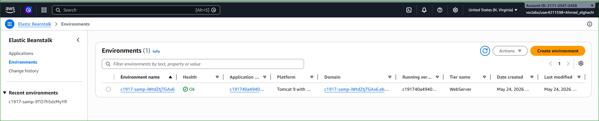
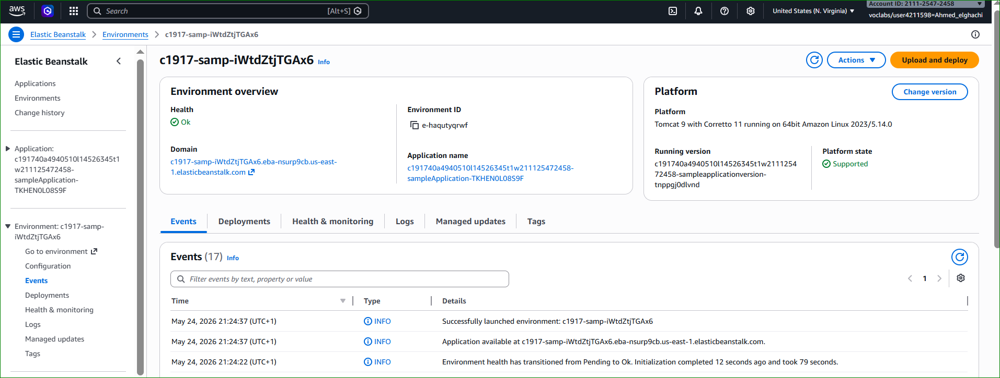
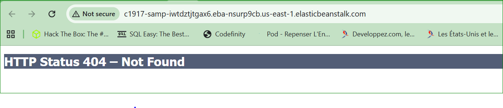
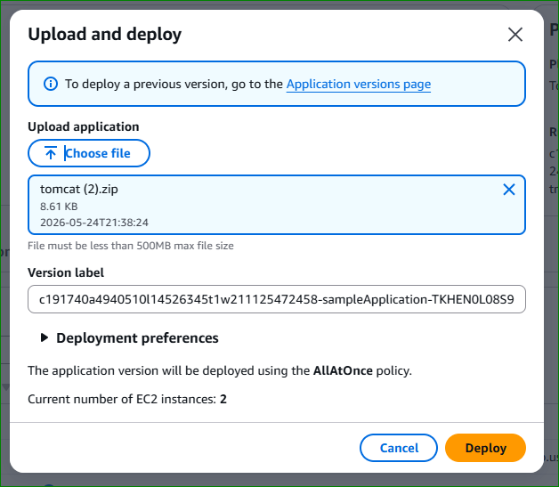
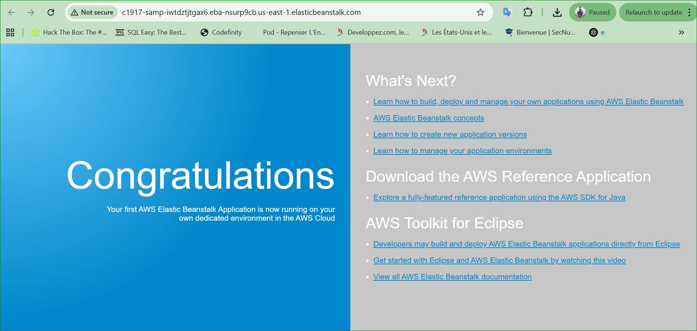
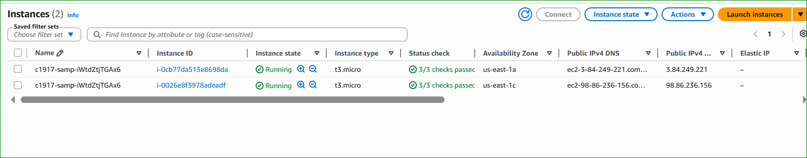
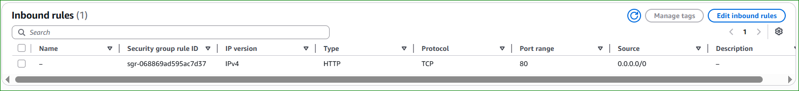
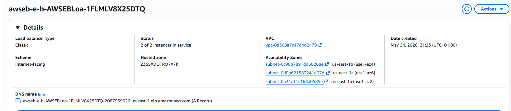
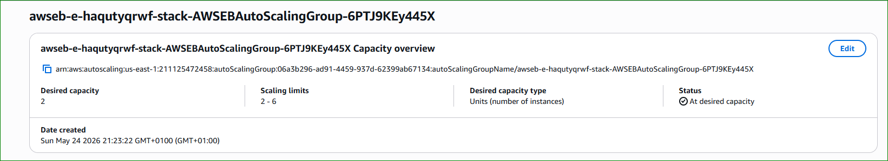

# 🌱 Activity: AWS Elastic Beanstalk

---

# 📌 Lab Overview

This activity provides you with an Amazon Web Services (AWS) account where an AWS Elastic Beanstalk environment has been pre-created for you.

You will:

- Deploy an application
- Explore Elastic Beanstalk resources
- Analyze EC2 infrastructure
- Observe Auto Scaling and Load Balancing
- Monitor the environment

---

# 🧠 What is AWS Elastic Beanstalk?

AWS Elastic Beanstalk is a Platform as a Service (PaaS) that simplifies application deployment and infrastructure management.

Elastic Beanstalk automatically manages:

- EC2 instances
- Load balancers
- Auto Scaling groups
- Monitoring
- Security groups

Developers can focus on application code while AWS manages the infrastructure.

---

# 🎯 Lab Objectives

After completing this lab, you will be able to:

✅ Access an Elastic Beanstalk environment  
✅ Deploy a sample application  
✅ Monitor the environment  
✅ Explore AWS infrastructure resources  
✅ Understand Auto Scaling and Load Balancing  

---

# 🏗️ Elastic Beanstalk Architecture

```text
                🌐 Internet Users
                        │
                        ▼
          ⚖️ Elastic Load Balancer (ELB)
                        │
        ┌───────────────┴───────────────┐
        ▼                               ▼
🖥️ EC2 Instance 1               🖥️ EC2 Instance 2
   (Tomcat App)                    (Tomcat App)
        │                               │
        └───────────────┬───────────────┘
                        ▼
              📈 Auto Scaling Group
                        │
                        ▼
                ☁️ Elastic Beanstalk
```

---

# 🌱 Task 1 — Access the Elastic Beanstalk Environment

## 📌 Description

In this task, you will access an existing Elastic Beanstalk environment.

---

# ⚙️ Step 1 — Open Elastic Beanstalk Console

In AWS Console:

- Search for:
  - `Elastic Beanstalk`

Choose:

- **Elastic Beanstalk**

---

# ⚙️ Step 2 — Open the Environment

The Environments page displays an existing Elastic Beanstalk application.

Verify:

| Parameter | Expected Value |
|---|---|
| Health | Ok |

If the health status is not:

```text
Ok
```

wait a few moments.

---

# 📸 Elastic Beanstalk Environment

<p align="center">
  
</p>

<p align="center">
  <em>Figure 1: Elastic Beanstalk Environment Dashboard</em>
</p>

---

# ⚙️ Step 3 — Open the Environment Dashboard

Under:

- **Environment name**

Choose the environment name.

The Elastic Beanstalk dashboard opens.

---

# 🧠 Environment Dashboard Explanation

The dashboard displays:

- Application health
- Running instances
- Monitoring metrics
- Environment configuration
- Deployment information

---

# 📸 Environment Dashboard

<p align="center">
  
</p>

<p align="center">
  <em>Figure 2: Elastic Beanstalk Dashboard</em>
</p>

---

# ⚙️ Step 4 — Test the Application URL

Near the top of the page:

- Choose the Domain URL
- URL ends with:
  - `elasticbeanstalk.com`

A new browser tab opens.

Expected result:

```text
HTTP Status 404 - Not Found
```

---

# 📸 HTTP 404 Error

<p align="center">
  
</p>

<p align="center">
  <em>Figure 3: HTTP 404 - No Application Deployed Yet</em>
</p>

---

# 🧠 Why Does the 404 Error Appear?

The infrastructure is running correctly, but:

- No application has been deployed yet.

The web server exists but contains no application code.

---

# 🌱 Task 2 — Deploy a Sample Application

## 📌 Description

You will now deploy a sample Tomcat web application.

---

# ⚙️ Step 1 — Download the Sample Application

Download:

```text
https://docs.aws.amazon.com/elasticbeanstalk/latest/dg/samples/tomcat.zip
```

Save:

```text
tomcat.zip
```

---

# ⚙️ Step 2 — Upload the Application

Return to the Elastic Beanstalk Dashboard.

Choose:

- **Upload and Deploy**

Then:

- Choose File
- Select:
  - `tomcat.zip`

Choose:

- **Deploy**

---

# 📸 Upload and Deploy Application

<p align="center">
  
</p>

<p align="center">
  <em>Figure 4: Upload and Deploy Tomcat Application</em>
</p>

---

# 🧠 Deployment Explanation

Elastic Beanstalk automatically:

✅ Deploys the application  
✅ Updates EC2 instances  
✅ Restarts services  
✅ Configures networking  
✅ Updates load balancer targets  

---

# ⚙️ Step 3 — Wait for Deployment

The deployment process takes:

- 1 to 2 minutes

Wait until:

| Parameter | Expected Value |
|---|---|
| Health | Ok |

---

# 📸 Deployment Progress

<p align="center">
  
</p>

<p align="center">
  <em>Figure 5: Elastic Beanstalk Deployment Progress</em>
</p>

---

# ⚙️ Step 4 — Access the Application

Choose the Domain URL again.

Expected result:

- The Tomcat sample web application appears successfully.

---

# 📸 Tomcat Application Running

<p align="center">
  
</p>

<p align="center">
  <em>Figure 6: Tomcat Web Application Successfully Deployed</em>
</p>

---

# ✅ Result

Congratulations!

You successfully deployed a web application using AWS Elastic Beanstalk.

---

# 🌱 Task 3 — Explore AWS Resources

## 📌 Description

Elastic Beanstalk automatically created AWS infrastructure resources.

You will now explore them.

---

# ⚙️ Step 1 — Open EC2 Console

Search for:

```text
EC2
```

Choose:

- **EC2**

---

# ⚙️ Step 2 — View Instances

Choose:

- **Instances**

You should observe:

- Two running EC2 instances

Their names typically contain:

```text
samp
```

---

# 📸 EC2 Instances Created by Elastic Beanstalk

<p align="center">
  
</p>

<p align="center">
  <em>Figure 7: EC2 Instances Hosting the Application</em>
</p>

---

# 🧠 EC2 Instance Explanation

The EC2 instances host:

- The deployed web application

Elastic Beanstalk automatically manages:

- Instance provisioning
- Scaling
- Health monitoring

---

# ⚙️ Step 3 — Explore Security Groups

Inside EC2 Console:

Choose:

- **Security Groups**

Observe:

- Port 80 (HTTP) is open

---

# 📸 Security Group Configuration

<p align="center">
  
</p>

<p align="center">
  <em>Figure 8: Security Group Allowing HTTP Traffic</em>
</p>

---

# Security Group Rules

```text
Inbound Rules
--------------------------------
HTTP   TCP   80   0.0.0.0/0
```

---

# 🧠 Security Group Explanation

The security group acts as a virtual firewall.

It controls:

- Inbound traffic
- Outbound traffic

Port 80 allows public web access.

---

# ⚙️ Step 4 — Explore Load Balancer

Inside EC2 Console:

Choose:

- **Load Balancers**

Observe:

- An Elastic Load Balancer

The load balancer distributes traffic between EC2 instances.

---

# 📸 Elastic Load Balancer

<p align="center">
  
</p>

<p align="center">
  <em>Figure 9: Elastic Load Balancer Distribution</em>
</p>

---

# Elastic Load Balancer Architecture

```text
🌐 Internet
      ↓
⚖️ Elastic Load Balancer
      ↓
🖥️ EC2 Instance 1
🖥️ EC2 Instance 2
```

---

# 🧠 Load Balancer Explanation

The load balancer improves:

- High availability
- Fault tolerance
- Performance
- Scalability

If one instance fails:

- Traffic is redirected automatically.

---

# ⚙️ Step 5 — Explore Auto Scaling

Inside EC2 Console:

Choose:

- **Auto Scaling Groups**

Observe:

| Parameter | Example Value |
|---|---|
| Minimum Instances | 2 |
| Maximum Instances | 6 |

---

# 📸 Auto Scaling Group

<p align="center">
  
</p>

<p align="center">
  <em>Figure 10: Auto Scaling Group Configuration</em>
</p>

---

# 🧠 Auto Scaling Explanation

Elastic Beanstalk automatically scales infrastructure based on:

- CPU usage
- Network traffic
- Application demand

Benefits:

✅ High availability  
✅ Cost optimization  
✅ Automatic scalability  

---

# ⚙️ Step 6 — Explore Monitoring

Return to:

- Elastic Beanstalk Console

Choose:

- **Monitoring**

Observe:

- CPU metrics
- Network traffic
- Request count
- Instance health

---

# 📸 Elastic Beanstalk Monitoring

<p align="center">
  
</p>

<p align="center">
  <em>Figure 11: CloudWatch Monitoring Metrics</em>
</p>

---

# 🧠 Monitoring Explanation

Elastic Beanstalk integrates with:

- Amazon CloudWatch

CloudWatch provides:

| Metric | Description |
|---|---|
| CPU Utilization | Processor usage |
| Network In/Out | Traffic monitoring |
| Request Count | Web requests |
| Instance Health | Environment status |

---

# 🧠 AWS Resources Created Automatically

| Resource | Purpose |
|---|---|
| 🖥️ EC2 Instances | Host applications |
| ⚖️ Load Balancer | Traffic distribution |
| 📈 Auto Scaling Group | Automatic scaling |
| 🔐 Security Groups | Firewall protection |
| 📊 CloudWatch | Monitoring |

---

# 🧠 Advantages of Elastic Beanstalk

| Advantage | Description |
|---|---|
| Easy Deployment | Fast application deployment |
| Managed Infrastructure | AWS manages resources |
| Scalability | Automatic scaling |
| Monitoring | Integrated monitoring |
| High Availability | Load balancing support |

---

# 🧠 Cybersecurity Perspective

Elastic Beanstalk improves security through:

- Security groups
- IAM integration
- Monitoring
- Automatic scaling
- Fault tolerance

It supports secure and highly available cloud applications.

---

# ✅ Final Result

You successfully:

✅ Accessed Elastic Beanstalk  
✅ Deployed a sample application  
✅ Explored EC2 infrastructure  
✅ Analyzed Auto Scaling and Load Balancing  
✅ Reviewed monitoring features  

---

# 🎓 Conclusion

AWS Elastic Beanstalk simplifies cloud application deployment by automatically provisioning and managing infrastructure resources.

It enables developers to:

- Deploy applications quickly
- Scale automatically
- Monitor performance
- Maintain high availability

Elastic Beanstalk is an excellent service for DevOps, cloud administration, and modern web application hosting.

---
