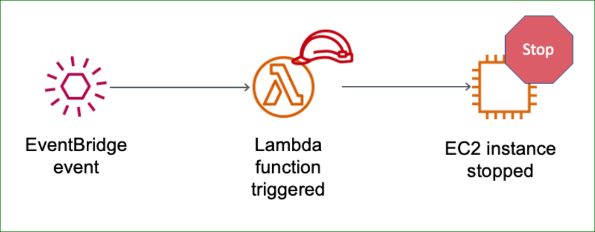
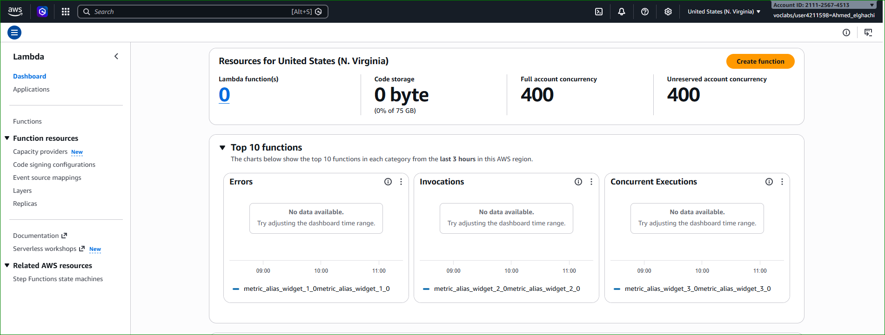

# ⚡ AWS Activity — AWS Lambda Automation for Amazon EC2

---

# 📌 Lab Overview

In this hands-on activity, you will create an AWS Lambda function that automatically stops an Amazon EC2 instance using Amazon EventBridge scheduling.

The Lambda function will run every minute and automatically stop a running EC2 instance using AWS APIs.

This activity demonstrates how serverless computing can automate cloud infrastructure management.

---

# 🧠 Introduction

AWS Lambda is a serverless compute service provided by Amazon Web Services (AWS).

It allows developers and administrators to:

- Run code without managing servers
- Automate AWS infrastructure
- Respond to cloud events
- Execute scheduled tasks
- Reduce operational overhead

In this activity:

- Amazon EventBridge triggers the Lambda function
- AWS Lambda executes Python code
- The Lambda function stops an EC2 instance automatically
- IAM permissions allow secure API access

---

# 🧠 Architectural Diagram

<p align="center">
  
</p>

<p align="center">
  <em>Figure 1: EventBridge Triggering AWS Lambda to Stop an EC2 Instance</em>
</p>

---

# 🎯 Activity Objectives

After completing this activity, you will be able to:

---

## ✅ Create an AWS Lambda Function

You will configure:

- Lambda Runtime
- IAM Execution Role
- Python Function Code

---

## ✅ Configure an EventBridge Trigger

You will create a scheduled EventBridge rule that triggers the Lambda function every minute.

---

## ✅ Automate EC2 Instance Management

The Lambda function will:

- Connect to Amazon EC2
- Stop a running EC2 instance automatically

---

## ✅ Monitor Lambda Execution

You will monitor:

- Lambda invocations
- Execution success rate
- Errors
- CloudWatch metrics

---

# 🌐 Task 1 — Create a Lambda Function

---

# 📌 Description

In this task, you will create an AWS Lambda function using Python 3.11.

The function will use an IAM role that allows it to stop EC2 instances.

---

# ⚙️ Step 1 — Open AWS Lambda Console

In the AWS Management Console:

- Search for:
  - `Lambda`

- Open:
  - **AWS Lambda Console**

---

# AWS Lambda Console

<p align="center">
  
</p>

<p align="center">
  <em>Figure 2: AWS Lambda Console</em>
</p>

---

# ⚙️ Step 2 — Create Lambda Function

Choose:

- **Create a function**

Configure:

| Parameter | Value |
|---|---|
| Creation Method | Author from scratch |
| Function Name | myStopinator |
| Runtime | Python 3.11 |

---

# Create Lambda Function

<p align="center">
  
</p>

<p align="center">
  <em>Figure 3: Create Lambda Function</em>
</p>

---

# ⚙️ Step 3 — Configure Execution Role

Expand:

- **Change default execution role**

Configure:

| Parameter | Value |
|---|---|
| Execution Role | Use an existing role |
| Existing Role | myStopinatorRole |

Choose:

- **Create function**

---

# 🧠 IAM Role Explanation

AWS Lambda uses IAM roles to securely interact with AWS services.

The IAM role:

- Grants EC2 permissions
- Allows stopping EC2 instances
- Controls API access securely

---

# Lambda Execution Role

<p align="center">
  
</p>

<p align="center">
  <em>Figure 4: Lambda Execution Role Configuration</em>
</p>

---

# ✅ Result

You successfully created the Lambda function:

```text
myStopinator
