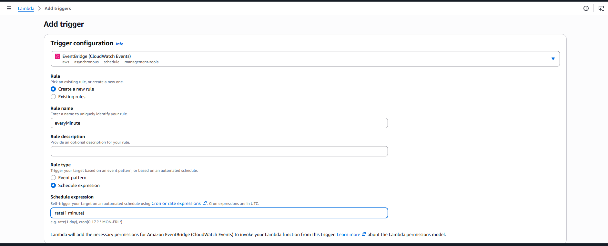
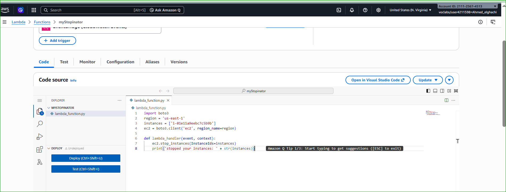
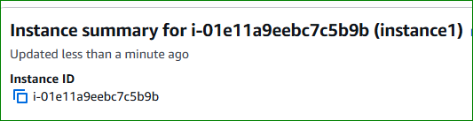
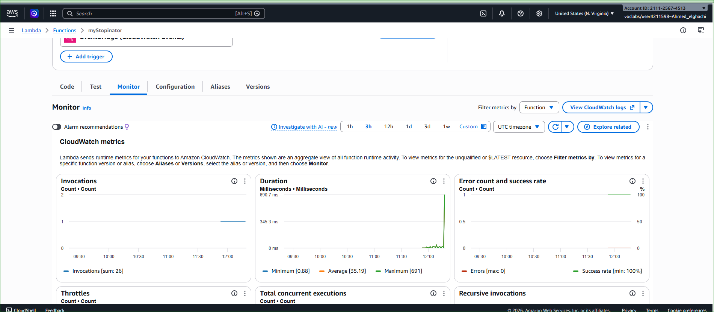

# ⚡ AWS Activity — AWS Lambda Automation for Amazon EC2

---

# 📌 Lab Overview

In this hands-on activity, you will create an AWS Lambda function that automatically stops an Amazon EC2 instance using Amazon EventBridge scheduling.

The Lambda function will run every minute and automatically stop a running EC2 instance using AWS APIs.

This activity demonstrates how serverless computing can automate cloud infrastructure management.

---

# 🧠 Introduction

AWS Lambda is a serverless compute service provided by Amazon Web Services (AWS).

It allows developers and administrators to:

- Run code without managing servers
- Automate AWS infrastructure
- Respond to cloud events
- Execute scheduled tasks
- Reduce operational overhead

In this activity:

- Amazon EventBridge triggers the Lambda function
- AWS Lambda executes Python code
- The Lambda function stops an EC2 instance automatically
- IAM permissions allow secure API access

---

# 🧠 Architectural Diagram

<p align="center">
  
</p>

<p align="center">
  <em>Figure 1: EventBridge Triggering AWS Lambda to Stop an EC2 Instance</em>
</p>

---

# 🎯 Activity Objectives

After completing this activity, you will be able to:

---

## ✅ Create an AWS Lambda Function

You will configure:

- Lambda Runtime
- IAM Execution Role
- Python Function Code

---

## ✅ Configure an EventBridge Trigger

You will create a scheduled EventBridge rule that triggers the Lambda function every minute.

---

## ✅ Automate EC2 Instance Management

The Lambda function will:

- Connect to Amazon EC2
- Stop a running EC2 instance automatically

---

## ✅ Monitor Lambda Execution

You will monitor:

- Lambda invocations
- Execution success rate
- Errors
- CloudWatch metrics

---

# 🌐 Task 1 — Create a Lambda Function

---

# 📌 Description

In this task, you will create an AWS Lambda function using Python 3.11.

The function will use an IAM role that allows it to stop EC2 instances.

---

# ⚙️ Step 1 — Open AWS Lambda Console

In the AWS Management Console:

- Search for:
  - `Lambda`

- Open:
  - **AWS Lambda Console**

---

# AWS Lambda Console

<p align="center">
  
</p>

<p align="center">
  <em>Figure 2: AWS Lambda Console</em>
</p>

---

# ⚙️ Step 2 — Create Lambda Function

Choose:

- **Create a function**

Configure:

| Parameter | Value |
|---|---|
| Creation Method | Author from scratch |
| Function Name | myStopinator |
| Runtime | Python 3.11 |

---

# ⚙️ Step 3 — Configure Execution Role

Expand:

- **Change default execution role**

Configure:

| Parameter | Value |
|---|---|
| Execution Role | Use an existing role |
| Existing Role | myStopinatorRole |

Choose:

- **Create function**

---

# 🧠 IAM Role Explanation

AWS Lambda uses IAM roles to securely interact with AWS services.

The IAM role:

- Grants EC2 permissions
- Allows stopping EC2 instances
- Controls API access securely

---

# ✅ Result

You successfully created the Lambda function:

```text
myStopinator
```
---
# ⏰ Task 2 — Configure the Lambda Trigger

## 📌 Description

In this task, you will configure an Amazon EventBridge rule to automatically trigger the AWS Lambda function every minute.

The EventBridge trigger works like:

- Linux cron jobs
- Windows scheduled tasks

This allows the Lambda function to execute automatically without managing a server.

---

# ⚙️ Step 1 — Open Lambda Function

From the AWS Lambda console:

- Select the function:
  - `myStopinator`

---

# ⚙️ Step 2 — Add Trigger

Inside the Lambda function page:

- Choose **Add trigger**

---

# 🧠 Trigger Explanation

A trigger is an AWS service or event source that automatically invokes a Lambda function.

Common Lambda triggers include:

| Trigger Type | Example |
|---|---|
| EventBridge | Scheduled execution |
| S3 | File upload |
| API Gateway | HTTP request |
| CloudWatch Logs | Log events |
| DynamoDB | Database changes |

In this lab, EventBridge will trigger the Lambda function every minute.

---

# ⚙️ Step 3 — Select EventBridge

Configure the trigger:

| Parameter | Value |
|---|---|
| Trigger Type | EventBridge (CloudWatch Events) |
| Rule | Create a new rule |
| Rule Name | everyMinute |
| Rule Type | Schedule expression |
| Schedule Expression | rate(1 minute) |

---

# EventBridge Trigger Configuration

<p align="center">
  
</p>

<p align="center">
  <em>Figure 2: Configuring EventBridge Trigger for Lambda</em>
</p>

---
---
# 🟧 Task 3 — Configure the Lambda Function

## 📌 Description

In this task, you will configure the AWS Lambda function code that automatically stops an Amazon EC2 instance.

The Lambda function uses:

- Python 3.11
- AWS SDK for Python (Boto3)
- IAM permissions
- Amazon EC2 API

The function will execute automatically every minute using the EventBridge trigger configured previously.

---
# ⚙️ Step 1 — Open the Lambda Code Editor

Inside the Lambda console:

- Select the function:
  - `myStopinator`

Choose:

- **Code**
- `lambda_function.py`

This opens the built-in AWS Lambda code editor.

---

# Lambda Code Editor

<p align="center">
  
</p>

<p align="center">
  <em>Figure 2: AWS Lambda Code Editor</em>
</p>

---

# ⚙️ Step 2 — Replace the Existing Code

Inside the **Code source** panel:

- Delete the existing sample code
- Copy and paste the following Python code:

```python
import boto3

region = 'us-east-1'

instances = ['i-1234567890abcdef0']

ec2 = boto3.client('ec2', region_name=region)

def lambda_handler(event, context):

    ec2.stop_instances(InstanceIds=instances)

    print('stopped your instances: ' + str(instances))
```

---

# 🧠 Code Explanation

| Code Section | Purpose |
|---|---|
| import boto3 | Imports AWS SDK for Python |
| region | Defines the AWS region |
| instances | Specifies EC2 instance ID |
| boto3.client() | Connects to Amazon EC2 |
| stop_instances() | Stops the EC2 instance |
| print() | Displays execution log |

---

# ⚠️ Important Configuration Notes

Replace:

```python
'us-east-1'
```

with your actual AWS Region.

Examples:

| Region Name | Region Code |
|---|---|
| US East (N. Virginia) | us-east-1 |
| Europe (Paris) | eu-west-3 |
| Europe (London) | eu-west-2 |

---

# 📌 Find Your EC2 Instance ID

To retrieve the instance ID:

1. Open the EC2 Console
2. Choose **Instances**
3. Locate:
   - `instance1`
4. Copy the Instance ID

Example:

```bash
i-0abc123456789xyz0
```

---

# EC2 Instance ID Example

<p align="center">
  
</p>

<p align="center">
  <em>Figure 3: Copying the EC2 Instance ID</em>
</p>

---

# ⚠️ Replace the Placeholder

Replace:

```python
instances = ['<REPLACE_WITH_INSTANCE_ID>']
```

with:

```python
instances = ['i-0abc123456789xyz0']
```

Keep:

- Single quotation marks `' '`
- Square brackets `[ ]`

---

# 🧠 How the Lambda Function Works

The execution flow:

1. EventBridge triggers Lambda
2. Lambda executes Python code
3. Boto3 connects to EC2
4. EC2 stop command is sent
5. Target instance shuts down

---

# 🔄 Lambda Execution Flow

```text
⏰ EventBridge Trigger
        ↓
🟧 AWS Lambda Function
        ↓
🐍 Python Boto3 SDK
        ↓
🖥️ Amazon EC2 API
        ↓
🛑 Stop EC2 Instance
```

---

# ⚙️ Step 3 — Save and Deploy the Function

Choose:

- **File**
- **Save**

Then choose:

- **Deploy**

AWS Lambda will deploy the updated code.

---

# Lambda Deployment Successful

<p align="center">
  
</p>

<p align="center">
  <em>Figure 4: Lambda Function Successfully Deployed</em>
</p>

---

# ⚙️ Step 4 — Open the Monitoring Tab

Choose:

- **Monitor**

The monitoring section displays:

- Function invocations
- Success rate
- Error count
- Execution duration

---

# Lambda Monitoring Dashboard

<p align="center">
  
</p>

<p align="center">
  <em>Figure 5: AWS Lambda Monitoring Metrics</em>
</p>

---

# 🧠 Monitoring Explanation

AWS Lambda integrates with:

- Amazon CloudWatch

CloudWatch automatically records:

| Metric | Description |
|---|---|
| Invocations | Number of executions |
| Errors | Failed executions |
| Duration | Execution time |
| Success Rate | Successful executions |

These metrics help administrators:

- Troubleshoot failures
- Analyze performance
- Monitor automation activity

---

# 📌 Expected Result

After approximately one minute:

✅ EventBridge triggers Lambda  
✅ Lambda executes successfully  
✅ EC2 instance automatically stops  

---

# 🧠 Cybersecurity & Automation Perspective

This automation demonstrates:

- Serverless computing
- Infrastructure automation
- Cloud orchestration
- Automated resource management

AWS Lambda is widely used in cybersecurity for:

- Incident response
- Automated remediation
- Log analysis
- Threat detection workflows

---

# ✅ Result

You successfully configured:

✅ AWS Lambda Python function  
✅ Boto3 EC2 automation  
✅ Automatic EC2 shutdown workflow  
✅ CloudWatch monitoring integration  

The Lambda function is now fully operational and will automatically stop the EC2 instance every minute.

---
