# Lab 5: Build Your DB Server and Interact With Your DB Using an App

## 📌 Lab Overview

This lab demonstrates how to deploy and use an **Amazon RDS MySQL database** with a web application running on Amazon EC2.

Amazon Relational Database Service (Amazon RDS) is a managed database service that simplifies the setup, operation, scaling, and maintenance of relational databases in AWS Cloud.

In this lab, you will:

- Create a security group for the database
- Create a DB subnet group
- Launch a Multi-AZ Amazon RDS MySQL instance
- Configure database connectivity
- Connect a web application to the database
- Interact with the database through the application

---

# 📖 Scenario Overview

<p align="center">
  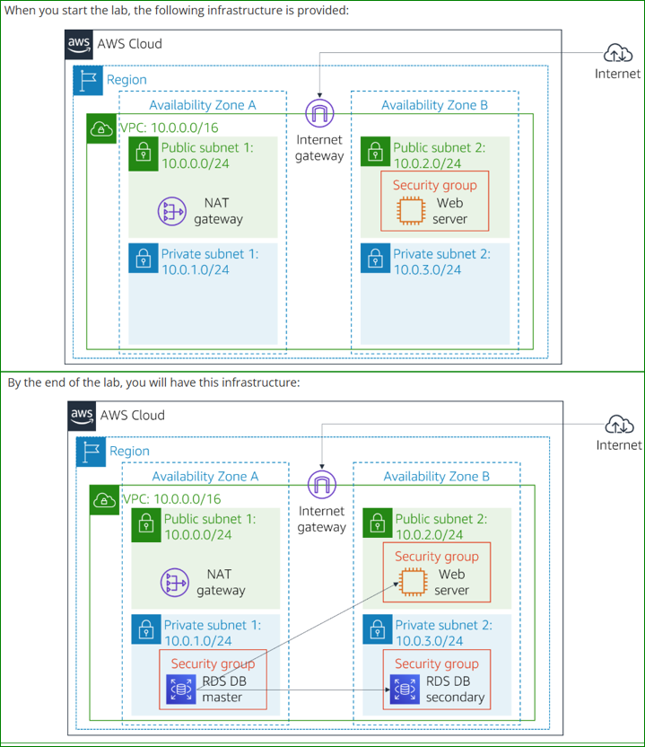
</p>

<p align="center">
  <em>Figure 1: Initial and Final AWS Infrastructure</em>
</p>

---

# 🎯 Objectives

By the end of this lab, you will be able to:

- Launch an Amazon RDS MySQL DB instance
- Configure database security groups
- Create a DB subnet group
- Enable high availability using Multi-AZ deployment
- Connect a web application to the database
- Store and retrieve data using the web application

---

# 📚 Prerequisites

Before starting this lab, you should be familiar with:

- Basic AWS Management Console navigation
- Amazon EC2 concepts
- Basic networking concepts
- Relational database fundamentals
- Security Groups and VPC basics

---

# 🔒 AWS Service Restrictions

In this lab environment, access is restricted only to the AWS services required for the lab.

Some AWS actions may not be available.

---

# 📖 What is Amazon RDS?

Amazon Relational Database Service (Amazon RDS) is a fully managed relational database service that simplifies database deployment and administration.

Amazon RDS supports several database engines:

- MySQL
- PostgreSQL
- MariaDB
- Oracle
- Microsoft SQL Server
- Amazon Aurora

---

# ⚙️ Amazon RDS Features

| Feature | Description |
|---|---|
| Managed Service | AWS manages backups, patching, monitoring |
| Multi-AZ Deployment | High availability and failover |
| Automated Scaling | Easy storage scaling |
| Security | VPC isolation and Security Groups |
| Automated Backups | Snapshot and point-in-time recovery |
| Monitoring | CloudWatch integration |

---

# 🌐 Initial Infrastructure

At the beginning of the lab, the following infrastructure is already available:

- Amazon EC2 Web Server
- Lab VPC
- Public and Private Subnets
- Web Security Group

---

# 🛡️ Task 1 — Create a Security Group for RDS

## Open VPC Service

1. Search for:

```text
VPC
```

2. Open:

```text
Security Groups
```

### Figure 4 — Open Security Groups

<p align="center">
  
</p>

<p align="center">
  <em>Figure 4: Open Security Groups</em>
</p>

---

## Create Security Group

Configure:

| Setting | Value |
|---|---|
| Security group name | DB Security Group |
| Description | Permit access from Web Security Group |
| VPC | Lab VPC |

### Figure 5 — Create DB Security Group

<p align="center">
  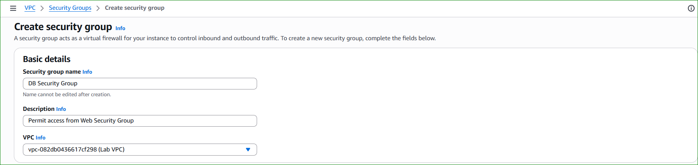
</p>

<p align="center">
  <em>Figure 5: Create DB Security Group</em>
</p>

---

## Add Inbound Rule

Configure:

| Setting | Value |
|---|---|
| Type | MySQL/Aurora |
| Port | 3306 |
| Source | Web Security Group |

### Figure 6 — Configure Inbound Rule

<p align="center">
  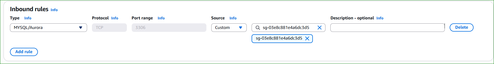
</p>

<p align="center">
  <em>Figure 6: Configure Database Security Group Rule</em>
</p>

---

# 🗂️ Task 2 — Create a DB Subnet Group

## Open RDS Service

1. Search for:

```text
RDS
```

2. Open:

```text
Subnet Groups
```

### Figure 7 — Open DB Subnet Groups

<p align="center">
  
</p>

<p align="center">
  <em>Figure 7: Open DB Subnet Groups</em>
</p>

---

## Create DB Subnet Group

Configure:

| Setting | Value |
|---|---|
| Name | DB-Subnet-Group |
| Description | DB Subnet Group |
| VPC | Lab VPC |

### Figure 8 — Create DB Subnet Group

<p align="center">
  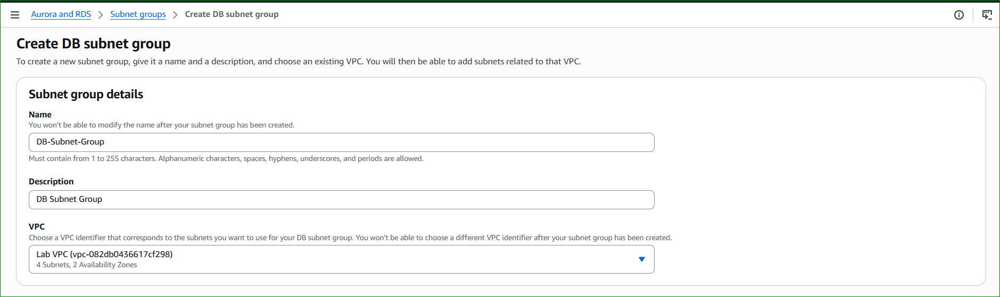
</p>

<p align="center">
  <em>Figure 8: Create DB Subnet Group</em>
</p>

---

## Select Availability Zones

Choose:

```text
us-east-1a
us-east-1b
```

### Figure 9 — Select Availability Zones

<p align="center">
  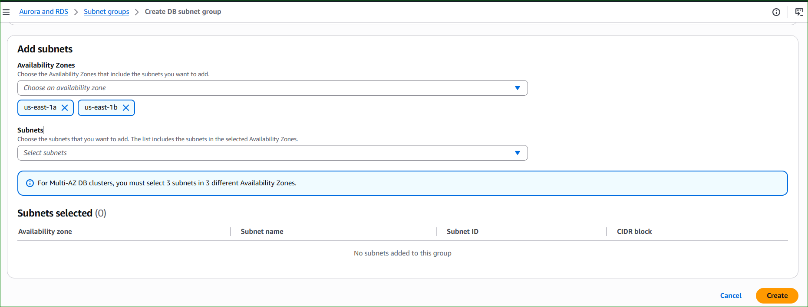
</p>

<p align="center">
  <em>Figure 9: Select Availability Zones</em>
</p>

---

## Select Subnets

Choose:

```text
10.0.1.0/24
10.0.3.0/24
```

### Figure 10 — Select Subnets

<p align="center">
  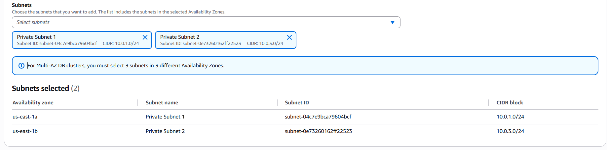
</p>

<p align="center">
  <em>Figure 10: Select Database Subnets</em>
</p>

---

# 🗄️ Task 3 — Create Amazon RDS DB Instance

## Open Databases

1. Go to:

```text
RDS → Databases
```

2. Click:

```text
Create Database
```

### Figure 11 — Create Database

<p align="center">
  
</p>

<p align="center">
  <em>Figure 11: Create Amazon RDS Database</em>
</p>

---

## Configure Engine Options

Choose:

| Setting | Value |
|---|---|
| Engine Type | MySQL |
| Template | Dev/Test |
| Availability | Multi-AZ DB Instance |

### Figure 12 — Configure Engine Options

<p align="center">
  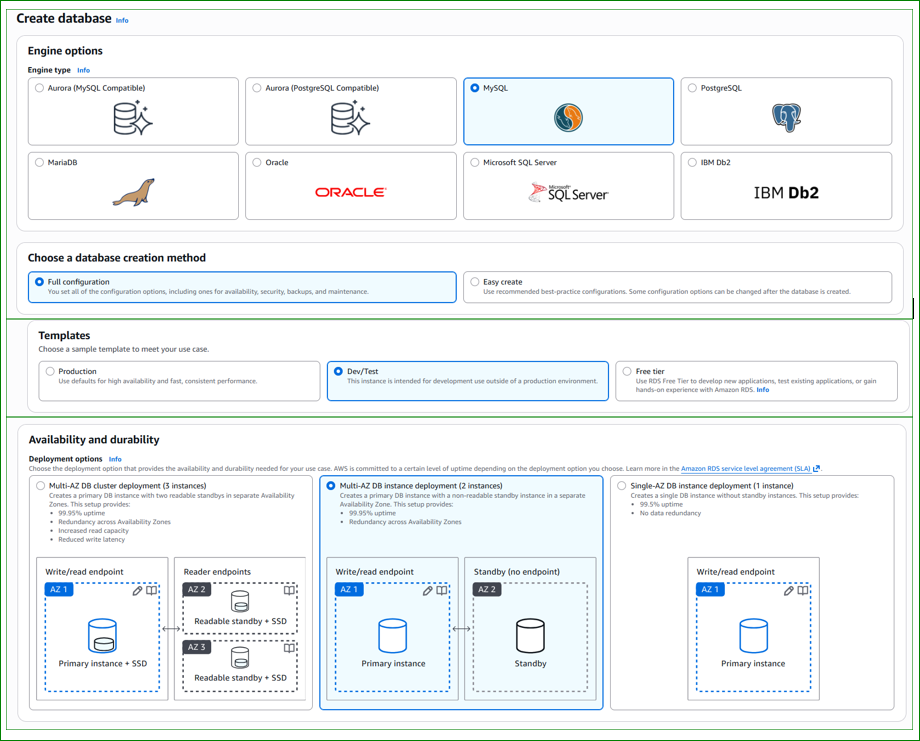
</p>

<p align="center">
  <em>Figure 12: Configure MySQL Engine</em>
</p>

---

## Configure Database Settings

| Setting | Value |
|---|---|
| DB Instance Identifier | lab-db |
| Master Username | main |
| Master Password | lab-password |

### Figure 13 — Configure Database Credentials

<p align="center">
  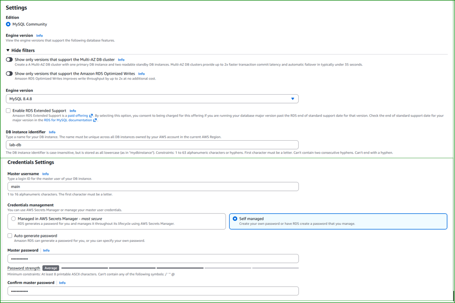
</p>

<p align="center">
  <em>Figure 13: Configure Database Credentials</em>
</p>

---

## Configure DB Instance Class

| Setting | Value |
|---|---|
| Class Type | Burstable |
| Instance Class | db.t3.micro |

### Figure 14 — Configure DB Instance Class

<p align="center">
  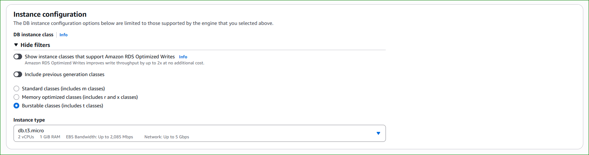
</p>

<p align="center">
  <em>Figure 14: Configure DB Instance Class</em>
</p>

---

## Configure Storage

| Setting | Value |
|---|---|
| Storage Type | General Purpose SSD |
| Allocated Storage | 20 GB |

### Figure 15 — Configure Storage

<p align="center">
  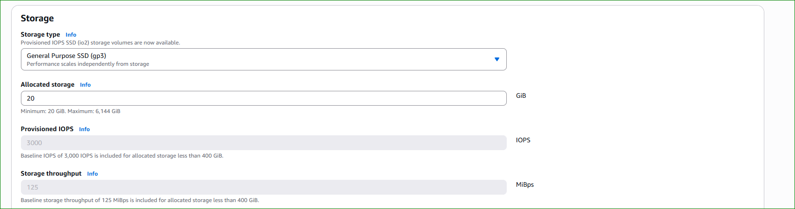
</p>

<p align="center">
  <em>Figure 15: Configure Database Storage</em>
</p>

---

## Configure Connectivity

| Setting | Value |
|---|---|
| VPC | Lab VPC |
| Security Group | DB Security Group |

### Figure 16 — Configure Connectivity

<p align="center">
  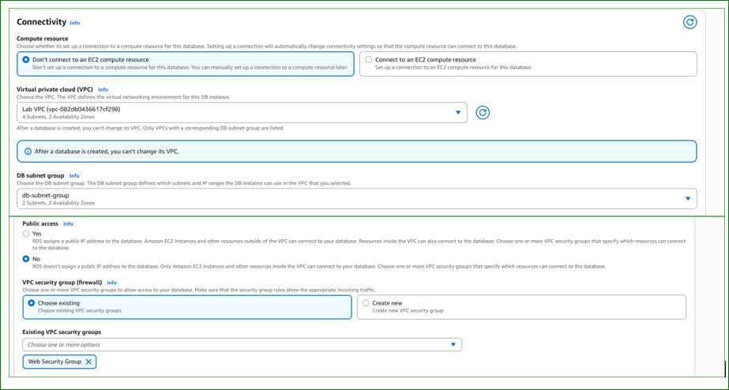
</p>

<p align="center">
  <em>Figure 16: Configure Database Connectivity</em>
</p>

---

## Disable Enhanced Monitoring

Uncheck:

```text
Enable Enhanced Monitoring
```

### Figure 17 — Disable Enhanced Monitoring

<p align="center">
  
</p>

<p align="center">
  <em>Figure 17: Disable Enhanced Monitoring</em>
</p>

---

## Additional Configuration

| Setting | Value |
|---|---|
| Initial Database Name | lab |
| Automatic Backups | Disabled |
| Encryption | Disabled |

### Figure 18 — Additional Configuration

<p align="center">
  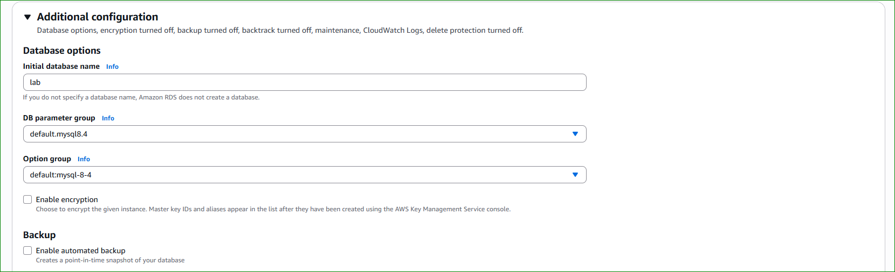
</p>

<p align="center">
  <em>Figure 18: Additional Database Configuration</em>
</p>

---

## Launch Database

Click:

```text
Create Database
```

### Figure 19 — Launch Database

<p align="center">
  
</p>

<p align="center">
  <em>Figure 19: Launch Amazon RDS Database</em>
</p>

---

## Verify Database Availability

Wait until the database status changes to:

```text
Available
```

### Figure 20 — Database Available

<p align="center">
  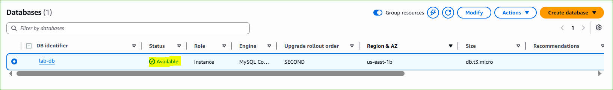
</p>

<p align="center">
  <em>Figure 20: Amazon RDS Database Available</em>
</p>

---

## Copy Database Endpoint

Copy the endpoint value:

```text
lab-db.xxxx.us-east-1.rds.amazonaws.com
```

### Figure 21 — Copy RDS Endpoint

<p align="center">
  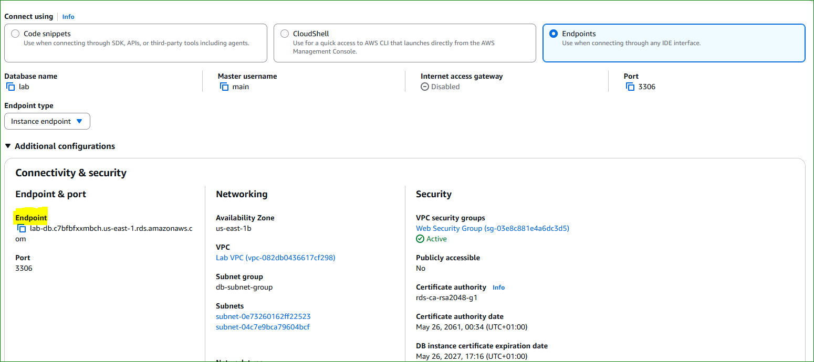
</p>

<p align="center">
  <em>Figure 21: Copy Database Endpoint</em>
</p>

---

# 🌐 Task 4 — Interact with Your Database

## Open Web Application

1. Copy the Web Server IP address
2. Open the IP address in a browser

### Figure 22 — Open Web Application

<p align="center">
  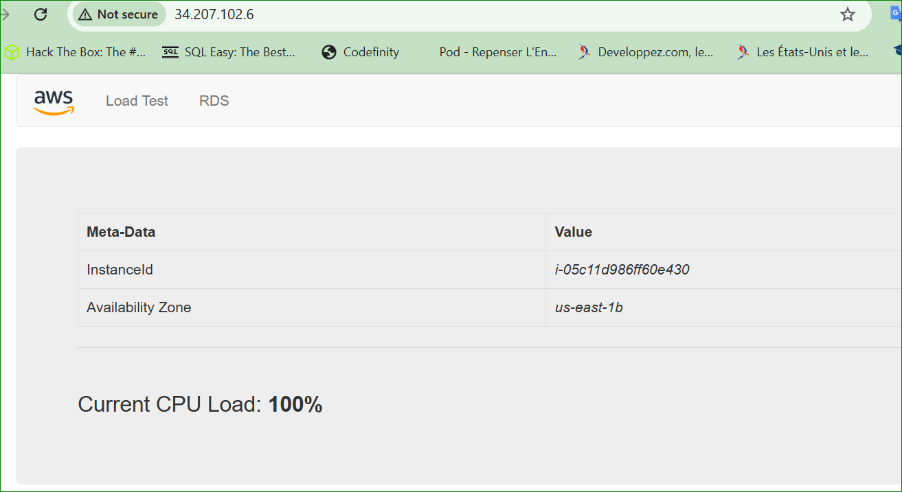
</p>

<p align="center">
  <em>Figure 22: Web Application Interface</em>
</p>

---

## Open RDS Configuration Page

Click:

```text
RDS
```

### Figure 23 — RDS Configuration Page

<p align="center">
  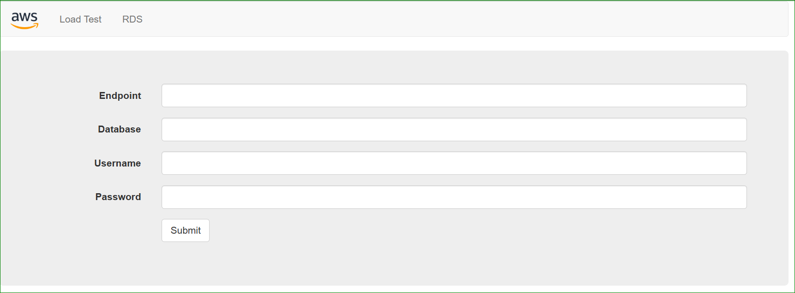
</p>

<p align="center">
  <em>Figure 23: Configure Web Application Database</em>
</p>

---

## Configure Database Connection

| Setting | Value |
|---|---|
| Endpoint | RDS Endpoint |
| Database | lab |
| Username | main |
| Password | lab-password |

### Figure 24 — Configure Database Connection

<p align="center">
  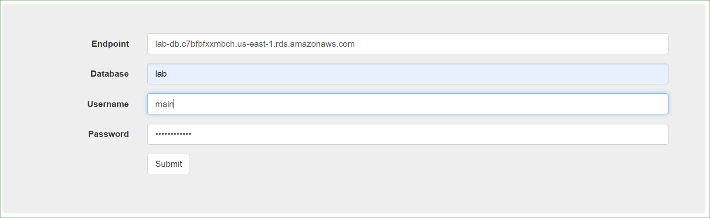
</p>

<p align="center">
  <em>Figure 24: Configure Application Database Connection</em>
</p>

---

## Submit Configuration

Click:

```text
Submit
```

### Figure 25 — Database Initialization

<p align="center">
  
</p>

<p align="center">
  <em>Figure 25: Database Initialization Process</em>
</p>

---

## Address Book Application

The application now connects successfully to Amazon RDS.

### Figure 26 — Address Book Application

<p align="center">
  
</p>

<p align="center">
  <em>Figure 26: Address Book Application Using Amazon RDS</em>
</p>

---

## Test Database Operations

You can now:

- Add contacts
- Edit contacts
- Delete contacts

The data is stored inside the RDS database.

### Figure 27 — Add Contact

<p align="center">
  
</p>

<p align="center">
  <em>Figure 27: Add Contact to Database</em>
</p>

---

# ✅ Conclusion

In this lab, you successfully:

- Created a database security group
- Configured a DB subnet group
- Deployed an Amazon RDS MySQL instance
- Enabled Multi-AZ high availability
- Connected a web application to the database
- Performed database operations through the application

---

# 🧠 Key Concepts Learned

| Concept | Description |
|---|---|
| Amazon RDS | Managed relational database service |
| Multi-AZ Deployment | High availability architecture |
| Security Groups | Database access control |
| DB Subnet Group | Defines subnets used by RDS |
| Endpoint | DNS address used to connect to the DB |
| Web Application Integration | EC2 application connected to RDS |

---

# 📌 Final Notes

Amazon RDS simplifies database administration by automating:

- Backups
- Monitoring
- Failover
- Scaling
- Maintenance

Using Multi-AZ deployments improves:

- Availability
- Durability
- Disaster Recovery

---

# 🏁 Lab Complete

Congratulations 🎉

You have completed:

✅ Security Group Configuration  
✅ DB Subnet Group Creation  
✅ Amazon RDS Deployment  
✅ Multi-AZ Database Configuration  
✅ Web Application Integration  
✅ Database Interaction Testing

---
