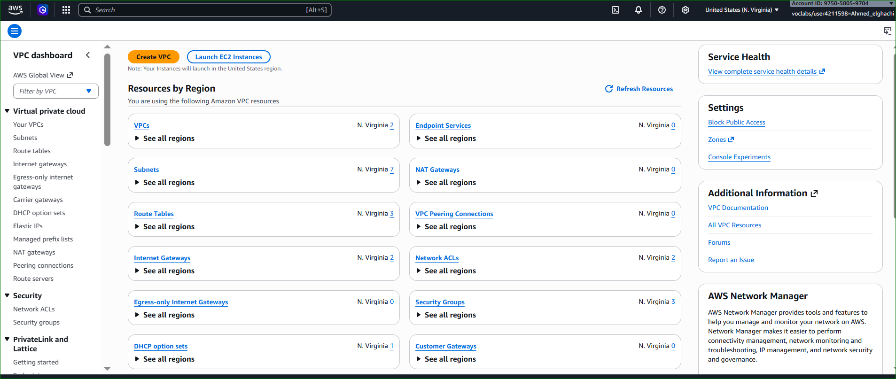
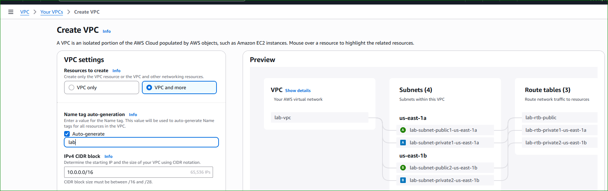
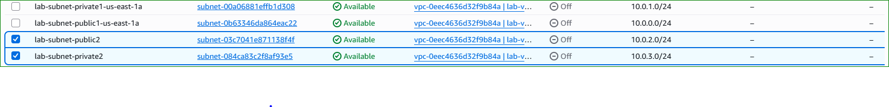
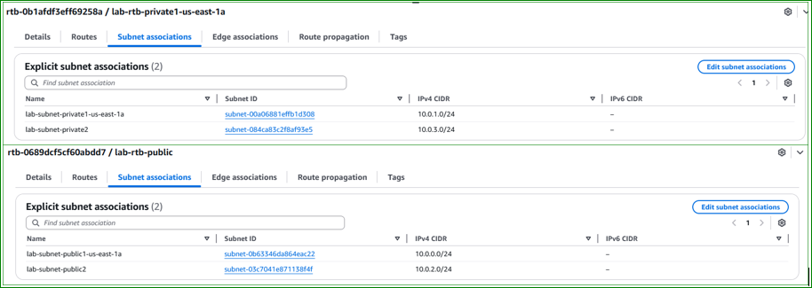
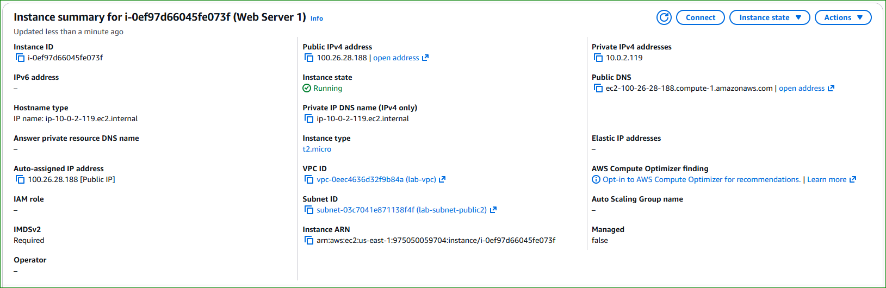

# 🌐 AWS Lab 2 – Build Your VPC and Launch a Web Server

---

# 📌 Lab Overview

This lab demonstrates how to build a complete AWS network using Amazon VPC and deploy a Web Server inside it.

You will create:
- A custom VPC
- Public & Private Subnets
- Route Tables
- Internet Gateway
- NAT Gateway
- Security Group
- EC2 Web Server

---

# 🧠 Architecture

<p align="center">
  
</p>

<p align="center">
  <em>Figure 1: Final AWS Architecture (VPC + Public/Private Subnets + NAT Gateway + EC2)</em>
</p>

---

# 🎯 Objectives

- Create a VPC
- Create Public & Private Subnets
- Configure Route Tables
- Configure Security Groups
- Launch an EC2 Web Server

---

# 🌐 Task 1 — Create Your VPC

---

# 📌 Description

In this task, you will create a complete AWS VPC infrastructure using the “VPC and more” option.

The wizard automatically creates:
- VPC
- Public Subnet
- Private Subnet
- Route Tables
- Internet Gateway
- NAT Gateway

---

# ⚙️ Step 1 — Open VPC Console

- Open AWS Management Console
- Search for VPC
- Open VPC Dashboard

---

# AWS VPC Dashboard

<p align="center">
  
</p>

<p align="center">
  <em>Figure 2: AWS VPC Dashboard</em>
</p>

---

# ⚙️ Step 2 — Create VPC

- Click Create VPC
- Select “VPC and more”

---

# Create VPC Wizard

<p align="center">
  
</p>

<p align="center">
  <em>Figure 3: Create VPC Wizard using “VPC and more”</em>
</p>

---

# ⚙️ Step 3 — Configure VPC

## General Configuration

- VPC Name: `lab-vpc`
- IPv4 CIDR: `10.0.0.0/16`
- Availability Zones: `1`
- Public Subnets: `1`
- Private Subnets: `1`

---

## Subnet CIDR Blocks

- Public Subnet: `10.0.0.0/24`
- Private Subnet: `10.0.1.0/24`

---

## Additional Settings

- NAT Gateway: Enabled
- DNS Hostnames: Enabled
- DNS Resolution: Enabled

---

# VPC Configuration

<p align="center">
  
</p>

<p align="center">
  <em>Figure 4: VPC Configuration Settings</em>
</p>

---

# VPC Resource Preview

<p align="center">
  
</p>

<p align="center">
  <em>Figure 5: Preview of VPC Resources before creation</em>
</p>

---

# ▶️ Step 4 — Create VPC

- Click Create VPC
- Wait until all resources are created

---

# 📸  5 — VPC Successfully Created

<p align="center">
  
</p>

<p align="center">
  <em>Figure 6: VPC Successfully Created</em>
</p>

---

# 🔎 Step 5 — Verify Subnets

Verify:
- Public Subnet
- Private Subnet

---

# Subnets

<p align="center">
  
</p>

<p align="center">
  <em>Figure 7: Public and Private Subnets</em>
</p>

---

# 🔀 Step 6 — Verify Route Tables

Verify:
- Public Route Table
- Private Route Table

---

# Route Tables

<p align="center">
  
</p>

<p align="center">
  <em>Figure 8: Route Tables Configuration</em>
</p>

---

# 🌍 Task 2 — Create Additional Subnets

---

# 📌 Create Public Subnet 2

- Name: `lab-subnet-public2`
- CIDR: `10.0.2.0/24`
- Availability Zone: `us-east-1b`

---

# 📌 Create Private Subnet 2

- Name: `lab-subnet-private2`
- CIDR: `10.0.3.0/24`
- Availability Zone: `us-east-1b`

---

# Additional Subnets

<p align="center">
  
</p>

<p align="center">
  <em>Figure 9: Additional Public and Private Subnets</em>
</p>

---

# 🔀 Configure Route Table Associations

Associate:
- Public Subnet 2 → Public Route Table
- Private Subnet 2 → Private Route Table

---

# Route Table Associations

<p align="center">
  
</p>

<p align="center">
  <em>Figure 10: Route Table Associations</em>
</p>

---

# 🔐 Task 3 — Create Security Group

---

# 📌 Security Group Configuration

- Name: `Web Security Group`
- Description: `Enable HTTP access`

---

# 📌 Inbound Rule

- Type: HTTP
- Source: Anywhere IPv4

---

# Security Group

<p align="center">
  
</p>

<p align="center">
  <em>Figure 11: Web Security Group Configuration</em>
</p>

---

# 🖥️ Task 4 — Launch EC2 Web Server

---

# 📌 EC2 Configuration

- Instance Name: `Web Server 1`
- AMI: Amazon Linux 2023
- Instance Type: t2.micro
- Key Pair: vockey

---

# 🌐 Network Settings

- VPC: `lab-vpc`
- Subnet: `lab-subnet-public2`
- Auto Public IP: Enabled
- Security Group: Web Security Group

---

# Launch EC2 Instance

<p align="center">
  
</p>

<p align="center">
  <em>Figure 12: Launch EC2 Instance Configuration</em>
</p>

---

# ⚙️ User Data Script

```bash
#!/bin/bash

# Install Apache Web Server and PHP
dnf install -y httpd wget php mariadb105-server unzip

# Download Application Files
wget https://aws-tc-largeobjects.s3.us-west-2.amazonaws.com/CUR-TF-100-ACCLFO-2/2-lab2-vpc/s3/lab-app.zip

# Extract Application
unzip lab-app.zip -d /var/www/html/

# Enable Apache Service
systemctl enable httpd

# Start Apache
systemctl start httpd
