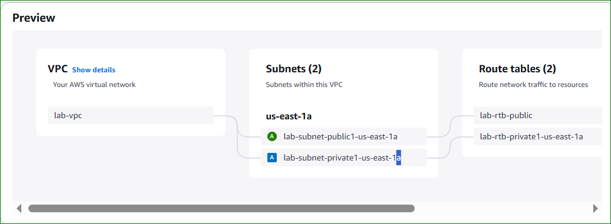
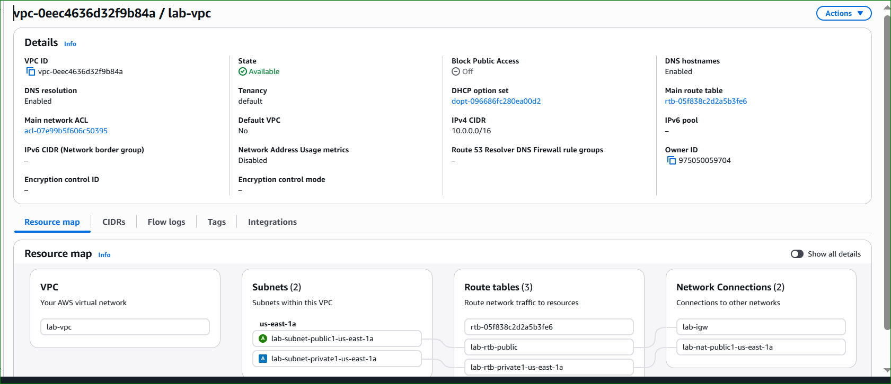

# 🌐 AWS Lab 2 – Build Your VPC and Launch a Web Server

---

## 📌 Lab Overview

This lab demonstrates how to build a complete AWS network using Amazon VPC and deploy a Web Server inside it.

You will create a custom virtual network with public and private subnets, configure routing, and deploy an EC2 instance.

---

## 🧠 Architecture

<p align="center">
  
</p>

<p align="center">
  <em>Figure 1: Final Architecture (VPC + Subnets + NAT + IGW)</em>
</p>

---

## 🎯 Objectives

- Create a VPC  
- Create Public & Private Subnets  
- Configure Route Tables  
- Create a Security Group  
- Launch an EC2 Instance  

---

# 🌐 Task 1: Create Your VPC

## 📌 Description

In this task, you will create a complete VPC infrastructure using the **“VPC and more”** option.  
This will automatically create:

- VPC  
- Public Subnet  
- Private Subnet  
- Internet Gateway  
- NAT Gateway  
- Route Tables  

---

## ⚙️ Step 1: Open VPC Console

- Go to **AWS Management Console**
- Search for **VPC**
- Click on **VPC Dashboard**

---

## 🌍 Step 2: Select Region

- Verify region: `us-east-1 (N. Virginia)`

---

## 🏗️ Step 3: Create VPC

- Click **Create VPC**
- Choose **VPC and more**

---

## ⚙️ Step 4: Configure VPC

### 🔧 General Configuration

- VPC Name: `lab-vpc`
- IPv4 CIDR Block: `10.0.0.0/16`
- Availability Zones: `1`
- Public Subnets: `1`
- Private Subnets: `1`

---

### 🌐 Subnet Configuration

- Public Subnet CIDR: `10.0.0.0/24`
- Private Subnet CIDR: `10.0.1.0/24`

---

### 🔌 Additional Settings

- NAT Gateway: **Enabled (1 AZ)**
- VPC Endpoints: **None**
- DNS Hostnames: **Enabled**
- DNS Resolution: **Enabled**

---

## 📸 Screenshot 1: VPC Configuration

<p align="center">
  
</p>

<p align="center">
  <em>Figure 1: VPC configuration using "VPC and more"</em>
</p>

---

## 🔍 Step 5: Review Resources

### Expected Resources:

- VPC → `lab-vpc`
- Public Subnet → `lab-subnet-public1-us-east-1a`
- Private Subnet → `lab-subnet-private1-us-east-1a`
- Route Tables:
  - `lab-rtb-public`
  - `lab-rtb-private1-us-east-1a`
- Internet Gateway → `lab-igw`
- NAT Gateway → `lab-nat-public1-us-east-1a`

---

## 📸 Screenshot 2: VPC Preview

<p align="center">
  
</p>

<p align="center">
  <em>Figure 2: Preview of VPC resources before creation</em>
</p>

---

## ▶️ Step 6: Create VPC

- Click **Create VPC**
- Wait until all resources are created
- NAT Gateway may take a few minutes

---

## 📸 Screenshot 3: VPC Created

<p align="center">
  
</p>

<p align="center">
  <em>Figure 3: VPC successfully created</em>
</p>

---

## 🔎 Step 7: Verify Components

Check the following:

- **Subnets**
- **Route Tables**
- **Internet Gateway**
- **NAT Gateway**

---

## 📸 Screenshot 4: Subnets

<p align="center">
  
</p>

<p align="center">
  <em>Figure 4: Public and Private subnets</em>
</p>

---

## 📸 Screenshot 5: Route Tables

<p align="center">
  
</p>

<p align="center">
  <em>Figure 5: Route tables configuration</em>
</p>

---

## 🧠 Explanation

### 🔹 VPC
- Logical isolated AWS network
- CIDR `/16` provides large IP range

### 🔹 Public Subnet
- Connected to Internet Gateway
- Used for public resources (Web Server)

### 🔹 Private Subnet
- No direct internet access
- Used for internal services

### 🔹 Internet Gateway (IGW)
- Enables internet access for public subnet

### 🔹 NAT Gateway
- Allows private subnet to access internet (outbound only)

### 🔹 Route Tables
- Control network traffic:
  - Public → IGW
  - Private → NAT

---

## ✅ Result

✔️ VPC created  
✔️ Subnets configured  
✔️ Internet access working  
✔️ Ready for EC2 deployment  

---

# 🌍 Task 2: Create Additional Subnets

## Public Subnet 2

- Name: `lab-subnet-public2`
- CIDR: `10.0.2.0/24`
- AZ: `us-east-1b`

## Private Subnet 2

- Name: `lab-subnet-private2`
- CIDR: `10.0.3.0/24`
- AZ: `us-east-1b`

---

## 📸 Screenshot

<p align="center">
  
</p>

---

# 🔀 Route Tables Configuration

## Public Route Table

| Destination | Target |
|------------|--------|
| 0.0.0.0/0 | Internet Gateway |

## Private Route Table

| Destination | Target |
|------------|--------|
| 0.0.0.0/0 | NAT Gateway |

---

## 📸 Screenshot

<p align="center">
  
</p>

---

## 🧠 Explanation

- Public subnet → direct internet  
- Private subnet → NAT (secure internet access)  

---

# 🔐 Task 3: Security Group

## Configuration

- Name: `Web Security Group`
- Rule: HTTP (Port 80)
- Source: `0.0.0.0/0`

---

## 📸 Screenshot

<p align="center">
  
</p>

---

## 🧠 Explanation

Acts as a firewall allowing only HTTP traffic.

---

# 🖥️ Task 4: Launch EC2 Instance

## Configuration

- Name: `Web Server 1`
- AMI: Amazon Linux 2023
- Type: t2.micro
- Key Pair: vockey

## Network

- VPC: lab-vpc
- Subnet: lab-subnet-public2
- Public IP: Enabled
- Security Group: Web Security Group

---

## 📸 Screenshot

<p align="center">
  
</p>

---

# ⚙️ User Data Script

```bash
#!/bin/bash

dnf update -y
dnf install -y httpd wget php mariadb105-server unzip

wget https://aws-tc-largeobjects.s3.us-west-2.amazonaws.com/CUR-TF-100-ACCLFO-2/2-lab2-vpc/s3/lab-app.zip

unzip lab-app.zip -d /var/www/html/

systemctl enable httpd
systemctl start httpd
