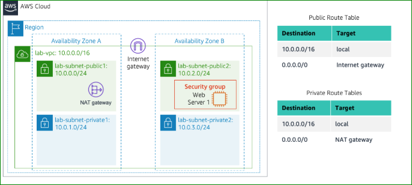
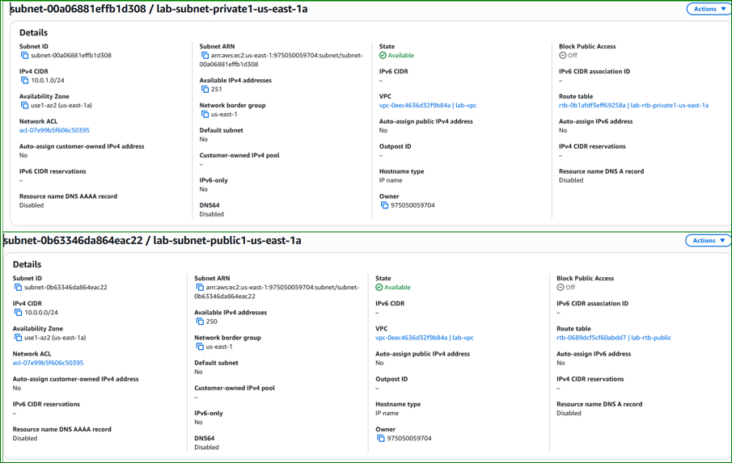
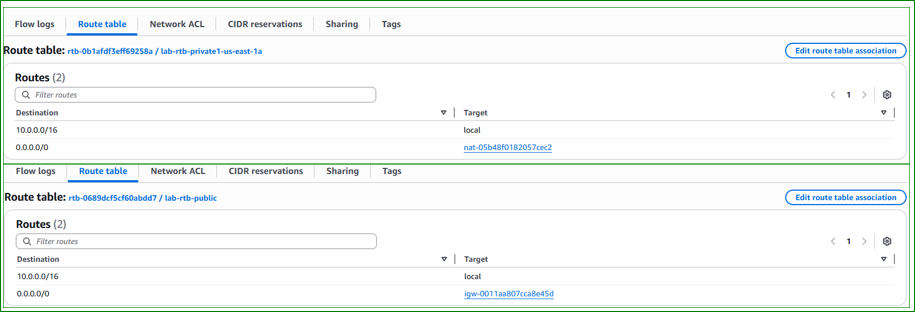
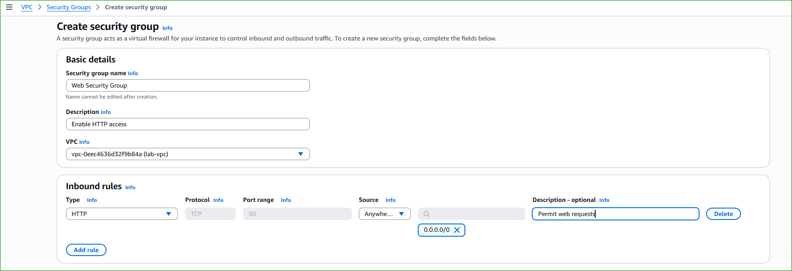

# 🌐 AWS Lab 2 – Build Your VPC and Launch a Web Server

---

## 📌 Lab Overview

This lab demonstrates how to build a complete AWS network using Amazon VPC and deploy a Web Server inside it.

You will create a custom virtual network with public and private subnets, configure routing, and deploy an EC2 instance.

---

## 🧠 Architecture

<p align="center">
  
</p>

<p align="center">
  <em>Figure 1: Final Architecture (VPC + Subnets + NAT + IGW)</em>
</p>

---

## 🎯 Objectives

- Create a VPC  
- Create Public & Private Subnets  
- Configure Route Tables  
- Create a Security Group  
- Launch an EC2 Instance  

---

# 🌐 Task 1: Create Your VPC

## Configuration

- VPC Name: `lab-vpc`
- CIDR Block: `10.0.0.0/16`
- Availability Zones: `1`
- Public Subnet: `10.0.0.0/24`
- Private Subnet: `10.0.1.0/24`

### Components created automatically:

- Internet Gateway (IGW)
- NAT Gateway
- Route Tables

---

## 📸 Screenshot

<p align="center">
  
</p>

---

## 🧠 Explanation

- VPC = isolated AWS network  
- Public subnet = internet access  
- Private subnet = secure internal resources  
- NAT Gateway = outbound internet access  

---

# 🌍 Task 2: Create Additional Subnets

## Public Subnet 2

- Name: `lab-subnet-public2`
- CIDR: `10.0.2.0/24`
- AZ: `us-east-1b`

## Private Subnet 2

- Name: `lab-subnet-private2`
- CIDR: `10.0.3.0/24`
- AZ: `us-east-1b`

---

## 📸 Screenshot

<p align="center">
  
</p>

---

# 🔀 Route Tables Configuration

## Public Route Table

| Destination | Target |
|------------|--------|
| 0.0.0.0/0 | Internet Gateway |

## Private Route Table

| Destination | Target |
|------------|--------|
| 0.0.0.0/0 | NAT Gateway |

---

## 📸 Screenshot

<p align="center">
  
</p>

---

## 🧠 Explanation

- Public subnet → direct internet  
- Private subnet → NAT (secure internet access)  

---

# 🔐 Task 3: Security Group

## Configuration

- Name: `Web Security Group`
- Rule: HTTP (Port 80)
- Source: `0.0.0.0/0`

---

## 📸 Screenshot

<p align="center">
  
</p>

---

## 🧠 Explanation

Acts as a firewall allowing only HTTP traffic.

---

# 🖥️ Task 4: Launch EC2 Instance

## Configuration

- Name: `Web Server 1`
- AMI: Amazon Linux 2023
- Type: t2.micro
- Key Pair: vockey

## Network

- VPC: lab-vpc
- Subnet: lab-subnet-public2
- Public IP: Enabled
- Security Group: Web Security Group

---

## 📸 Screenshot

<p align="center">
  
</p>

---

# ⚙️ User Data Script

```bash
#!/bin/bash

dnf update -y
dnf install -y httpd wget php mariadb105-server unzip

wget https://aws-tc-largeobjects.s3.us-west-2.amazonaws.com/CUR-TF-100-ACCLFO-2/2-lab2-vpc/s3/lab-app.zip

unzip lab-app.zip -d /var/www/html/

systemctl enable httpd
systemctl start httpd
