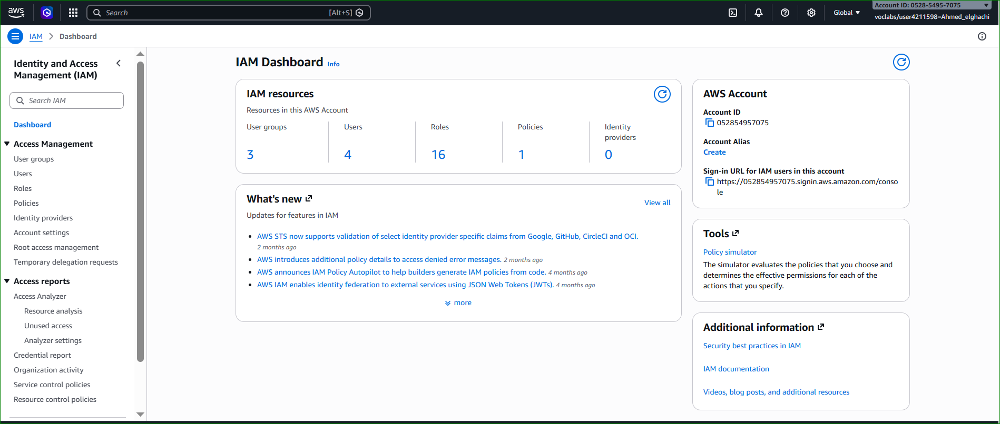
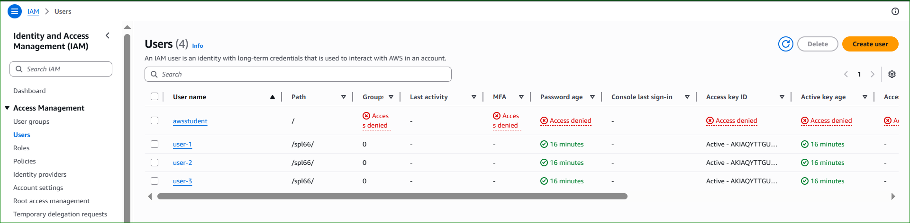
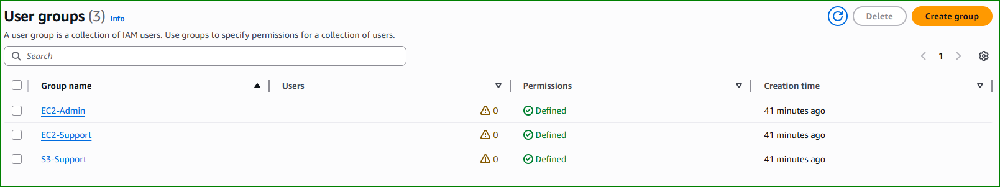
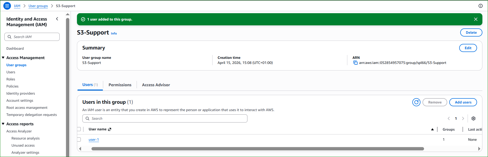
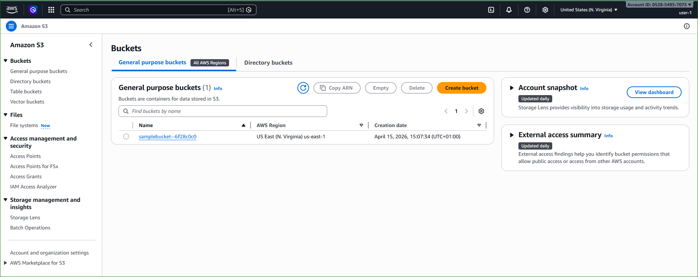
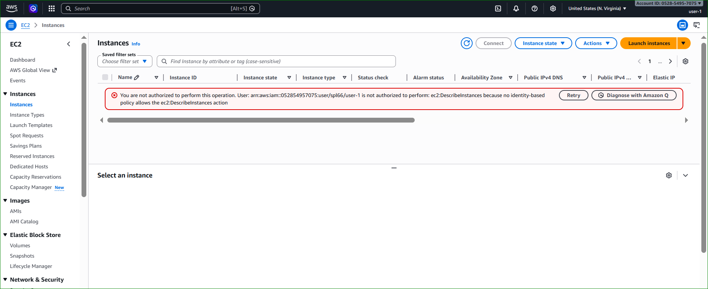
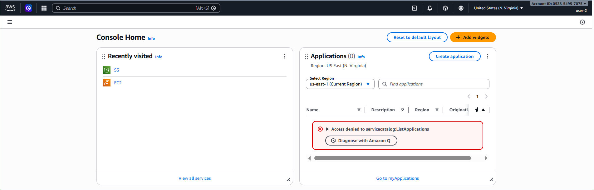
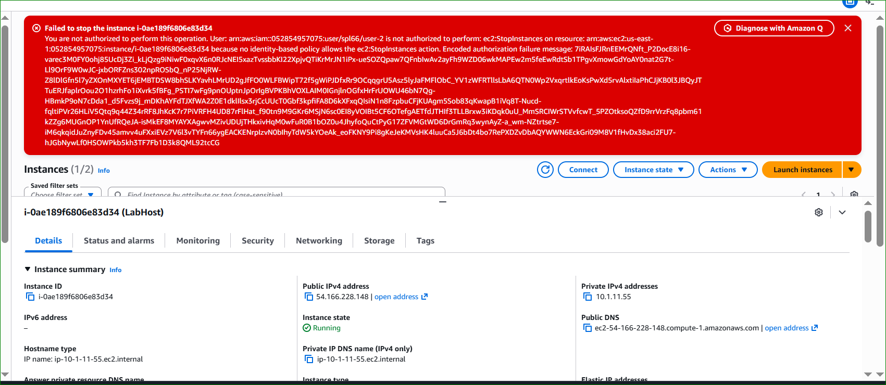
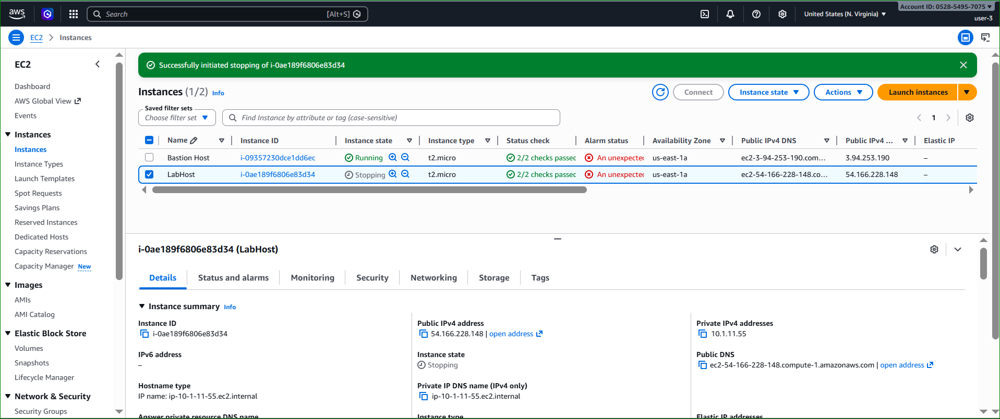

# 🔐 Lab 1: Introduction to AWS IAM

## 📌 Overview

AWS Identity and Access Management (IAM) is a web service that enables Amazon Web Services (AWS) customers to manage users and user permissions in AWS.  

With IAM, you can centrally manage:
- Users  
- Security credentials (passwords, access keys, MFA)  
- Permissions controlling which AWS resources users can access  

---

## 🎯 Lab Objectives

This lab demonstrates:

- Exploring pre-created IAM Users and Groups  
- Inspecting IAM Policies  
- Assigning users to groups  
- Using IAM sign-in URL  
- Testing access control  

---

## ⚠️ AWS Service Restrictions

In this lab environment:
- Some AWS services may be restricted  
- You might see "Not authorized" errors  
- Only required services are available  

---

## 🧠 IAM Concepts

IAM allows you to:

- Manage IAM Users and permissions  
- Manage IAM Roles (temporary access)  
- Enable federated access (SSO)  

---

## 🏗️ IAM Architecture Diagram

  

  <em>Figure 1: IAM Users, Groups and Policies mapping</em>

---

## ⏱️ Duration

⏳ Approx. **40 minutes**

---

## 🚀 Accessing the AWS Management Console

### Step 1: Start Lab
- Click **Start Lab**
- Wait until the indicator turns **green**

---

### Step 2: Open AWS Console
- Click **AWS link**
- Allow pop-ups if blocked

---

### Step 3: Setup Workspace
- Arrange:
  - AWS Console  
  - Lab instructions  

---

## 🛠️ Task 1: Explore Users and Groups

### Step 1: Open IAM
- Go to **Services**
- Search **IAM**

  

  <em>Figure 2: IAM Dashboard</em>

---

### Step 2: View Users
- Click **Users**
- Existing users:
  - user-1  
  - user-2  
  - user-3  

  

  <em>Figure 3: IAM Users List</em>

---

### Step 3: Inspect user-1
- Permissions → ❌ None  
- Groups → ❌ None  
- Security Credentials → ✅ Password  

---

### Step 4: Explore Groups
- Go to **User Groups**

Groups:
- EC2-Admin  
- EC2-Support  
- S3-Support  

  

  <em>Figure 4: IAM Groups Overview</em>

---

### Step 5: Analyze EC2-Support Policy
- Policy: `AmazonEC2ReadOnlyAccess`

  

  <em>Figure 5: EC2 ReadOnly Policy</em>

✔️ Allows:
- Describe instances  
- View resources  

❌ Cannot:
- Start / Stop instances  

---

### Step 6: Analyze S3-Support Policy
- Policy: `AmazonS3ReadOnlyAccess`

✔️ Allows:
- List buckets  
- Read objects  

---

### Step 7: Analyze EC2-Admin Policy
- Inline Policy  

✔️ Allows:
- Start / Stop instances  
- Full EC2 control  

---

## 🧑‍💼 Task 2: Add Users to Groups

### 🎯 Scenario

| User   | Group         | Permissions |
|--------|--------------|------------|
| user-1 | S3-Support   | Read-only S3 |
| user-2 | EC2-Support  | Read-only EC2 |
| user-3 | EC2-Admin    | Start/Stop EC2 |

---

### Step 1: Add user-1
- Go to **S3-Support**
- Add `user-1`

  

  <em>Figure 6: Add user-1 to S3-Support</em>

---

### Step 2: Add user-2
- Assign to **EC2-Support**

---

### Step 3: Add user-3
- Assign to **EC2-Admin**

---

### Step 4: Verify
- Each group must contain **1 user**

---

## 🔐 Task 3: Test User Access

### Step 1: Get IAM Login URL
- Copy from IAM Dashboard  

---

### Step 2: Open Incognito Window

---

## 🧪 Test user-1

Login:
- user-1 / Lab-Password1  

### S3 Access

  

  <em>Figure 7: user-1 accessing S3</em>

✔️ Allowed  

---

### EC2 Access

  

  <em>Figure 8: user-1 denied EC2 access</em>

❌ Denied  

---

## 🧪 Test user-2

Login:
- user-2 / Lab-Password2  

### EC2 Read Only

  

  <em>Figure 9: user-2 EC2 ReadOnly</em>

---

### Stop Instance

  

  <em>Figure 10: Stop instance denied</em>

---

### S3 Access
❌ Denied  

---

## 🧪 Test user-3

Login:
- user-3 / Lab-Password3  

### EC2 Admin

  

  <em>Figure 11: EC2 Admin full access</em>

✔️ Allowed to stop instance  

---

## 📤 Submitting the Lab

- Click **Submit**
- Wait a few minutes  
- Check **Grades**  

---

## 🧾 Conclusion

You have successfully:

- Explored IAM Users & Groups  
- Analyzed IAM Policies  
- Implemented Role-Based Access Control (RBAC)  
- Tested permissions  

---

## 🔐 Security Best Practices

- Use Least Privilege  
- Use Groups  
- Enable MFA  
- Avoid root account  

---

## 📌 Status

✅ Completed
