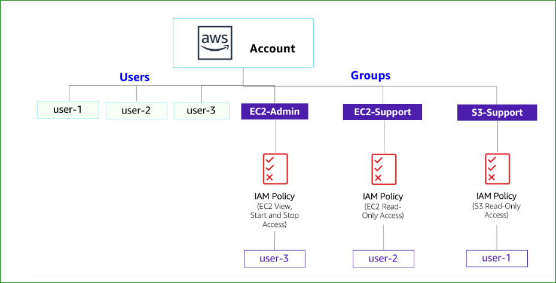

# 🔐 Lab 1: Introduction to AWS IAM

## 📌 Overview

AWS Identity and Access Management (IAM) is a core AWS service that enables secure control of access to AWS resources.  
It allows you to manage users, groups, roles, and permissions in a centralized way.

---

## 🎯 Objectives

In this lab, you will:

- Explore pre-created IAM Users and Groups  
- Understand IAM Policies and permissions  
- Assign users to groups based on roles  
- Test access control using different IAM users  
- Learn how permissions impact AWS service access  

---

## ⏱️ Duration

⏳ Approx. **40 minutes**

---

## 🧠 Key Concepts

- **IAM User**: Represents an individual with login credentials  
- **IAM Group**: Collection of users with shared permissions  
- **IAM Role**: Temporary access for users or AWS services  
- **Policy**: JSON document defining permissions (Allow / Deny)  
- **MFA**: Multi-Factor Authentication for enhanced security  

---

## 🏗️ IAM Architecture Diagram

  

  <em>Figure: IAM Users, Groups and Policies mapping</em>

---

## 📌 Architecture Explanation

- `user-1` → assigned to **S3-Support** (Read-only S3 access)  
- `user-2` → assigned to **EC2-Support** (Read-only EC2 access)  
- `user-3` → assigned to **EC2-Admin** (Start/Stop EC2 instances)  

👉 This demonstrates **Role-Based Access Control (RBAC)** using IAM groups.

---

## 🛠️ Tasks & Implementation

### 🔍 Task 1: Explore Users and Groups

- Navigate to IAM Dashboard  
- View existing users:
  - `user-1`
  - `user-2`
  - `user-3`

- Check:
  - Permissions → No permissions assigned  
  - Groups → No group membership  
  - Security Credentials → Console password  

- Explore IAM Groups:
  - `EC2-Admin`
  - `EC2-Support`
  - `S3-Support`

- Analyze attached policies:
  - `AmazonEC2ReadOnlyAccess`
  - `AmazonS3ReadOnlyAccess`
  - Inline policy (EC2-Admin)

---

### 🧑‍💼 Task 2: Add Users to Groups

| User   | Group         | Permissions |
|--------|--------------|------------|
| user-1 | S3-Support   | Read-only S3 |
| user-2 | EC2-Support  | Read-only EC2 |
| user-3 | EC2-Admin    | Start/Stop EC2 |

#### Steps:

- Add `user-1` → **S3-Support**
- Add `user-2` → **EC2-Support**
- Add `user-3` → **EC2-Admin**

✅ Verify each group has 1 user assigned

---

### 🔐 Task 3: Test User Access

#### 🔹 Test user-1 (S3 Support)

- Login using IAM Sign-in URL  
- Access **S3 → ✅ Allowed**  
- Access **EC2 → ❌ Denied**

---

#### 🔹 Test user-2 (EC2 Support)

- Access **EC2 → 👁️ Read-only allowed**  
- Try stopping instance → ❌ Denied  
- Access **S3 → ❌ Denied**

---

#### 🔹 Test user-3 (EC2 Admin)

- Access EC2  
- Start/Stop instance → ✅ Allowed  

---

## 🔐 Security Best Practices

- Apply **Least Privilege Principle**  
- Use **Groups instead of individual permissions**  
- Enable **MFA for all users**  
- Avoid using root account  
- Use **roles for temporary access**  

---

## ⚠️ Common Issues

- ❌ Access denied → Check IAM policies  
- ❌ Cannot see EC2 → Check selected Region  
- ❌ Login issues → Verify credentials  

---

## 📸 Screenshots

- IAM Dashboard  
- Users & Groups  
- Policy details  
- User login tests  
- EC2/S3 access results  

---

## 📚 What I Learned

- How IAM manages access in AWS  
- Difference between Users, Groups, and Roles  
- How policies control permissions  
- Real-world implementation of access control  

---

## 🚀 Next Step

➡️ Continue with: **🌐 VPC Web Server Lab**

---

## 📌 Status

✅ Completed
