# 🌐 AWS Lab 3 – Introduction to Amazon EC2

---

# 📌 Lab Overview and Objectives

## 🧠 Introduction

This lab provides a practical introduction to launching, managing, resizing, and monitoring an Amazon EC2 instance.

Amazon Elastic Compute Cloud (Amazon EC2) is a web service that provides resizable compute capacity in the cloud. It is designed to make web-scale cloud computing easier for developers.

Amazon EC2 provides a simple web service interface that allows users to:

- Launch virtual servers quickly
- Configure computing resources easily
- Scale infrastructure dynamically
- Manage cloud servers efficiently

Amazon EC2 gives you complete control over your computing resources and allows you to run applications on Amazon’s highly reliable cloud infrastructure.

One of the major advantages of Amazon EC2 is its flexibility:

- You can increase or decrease resources at any time
- You only pay for the resources you use
- You can deploy applications within minutes

Amazon EC2 also helps developers build highly available and fault-tolerant applications while reducing infrastructure costs.

---

# 🧠 Architectural Diagram

<p align="center">
  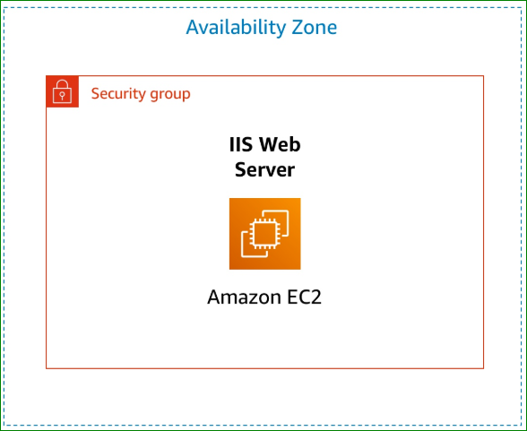
</p>

<p align="center">
  <em>Figure 1: Amazon EC2 Web Server Architecture</em>
</p>

---

# 🎯 Lab Objectives

After completing this lab, you will be able to:

## ✅ Launch a Web Server with Termination Protection Enabled

You will create and configure an Amazon EC2 instance running a web server while enabling termination protection to prevent accidental deletion.

---

## ✅ Monitor Your EC2 Instance

You will use monitoring tools such as:

- Status Checks
- CloudWatch Metrics
- System Logs
- Instance Screenshots

to observe the health and performance of your instance.

---

## ✅ Modify the Security Group to Allow HTTP Access

You will configure inbound security group rules to allow web traffic on port 80 (HTTP) so users can access the hosted web application.

---

## ✅ Resize Your Amazon EC2 Instance

You will:

- Change the EC2 instance type
- Increase computing resources
- Modify the EBS storage volume size

This demonstrates how AWS supports scalability.

---

## ✅ Enable and Test Stop Protection

You will enable stop protection to prevent accidental stopping of your EC2 instance and test how this protection works.

---

## ✅ Explore Amazon EC2 Limits

You will use AWS Service Quotas to explore:

- EC2 instance limits
- Running instance quotas
- Resource limitations per region

---

## ✅ Stop Your EC2 Instance

You will safely stop your EC2 instance after disabling stop protection.

---

# ⏱️ Duration

Approximate time: 35 minutes

---

# 🌐 Task 1 — Launch Your Amazon EC2 Instance

## 📌 Description

In this task, you will launch an Amazon EC2 instance with:

- Termination Protection
- Stop Protection
- User Data Script
- Apache Web Server

The EC2 instance will host a simple web application accessible from the internet.

---

# ⚙️ Step 1 — Open EC2 Console

- Open AWS Management Console
- Choose ▦ **Services**
- Select **Compute**
- Choose **EC2**

Verify the region:

- `N. Virginia (us-east-1)`

---

# ⚙️ Step 2 — Launch Instance

- Click **Launch instance**
- Select **Launch instance**

---

# ⚙️ Step 3 — Configure Name and Tags

Set the instance name:

- `Web Server`

AWS automatically creates a tag:

| Key | Value |
|------|------|
| Name | Web Server |

Tags help organize AWS resources.

---

# ⚙️ Step 4 — Choose Amazon Machine Image (AMI)

Keep the default selections:

- Amazon Linux
- Amazon Linux 2023 AMI

---

# 🧠 AMI Explanation

An Amazon Machine Image (AMI) provides:

- Operating System
- Software packages
- Storage configuration
- Launch permissions

The AMI acts as the template for the EC2 instance.

---

# ⚙️ Step 5 — Choose Instance Type

Keep default instance type:

- `t2.micro`

Specifications:

- 1 vCPU
- 1 GiB RAM

---

# 🧠 Instance Type Explanation

Amazon EC2 instance types define:

- CPU resources
- Memory capacity
- Storage performance
- Network performance

The `t2.micro` instance is ideal for lightweight workloads and AWS labs.

---

# ⚙️ Step 6 — Configure Key Pair

Select:

- `vockey`

---

# 🧠 Key Pair Explanation

AWS uses public-key cryptography for secure authentication.

The key pair allows:

- Secure SSH access
- Secure instance authentication

In this lab, the key pair is required even if SSH is not used.

---

# ⚙️ Step 7 — Configure Network Settings

Choose:

- VPC: `Lab VPC`
- Subnet: `PublicSubnet1`

Keep:

- Auto-assign Public IP enabled

---

# 🌐 Configure Security Group

Choose:

- Create security group

Configure:

| Parameter | Value |
|------|------|
| Security Group Name | Web Server security group |
| Description | Security group for my web server |

Remove the default inbound SSH rule.

---

# 🧠 Security Group Explanation

A security group acts as a virtual firewall.

It controls:

- Inbound traffic
- Outbound traffic

Currently:

- No inbound rules are configured
- HTTP access will be added later

---

# ⚙️ Step 8 — Configure Storage

Keep default storage settings:

| Volume Type | Size |
|------|------|
| gp3 SSD | 8 GiB |

---

# 🧠 Storage Explanation

Amazon EC2 uses Amazon Elastic Block Store (EBS).

The root volume:

- Stores the operating system
- Stores applications and data

---

# ⚙️ Step 9 — Configure Advanced Details

Expand:

- Advanced details

Enable:

- Termination Protection

---

# 🧠 Termination Protection

Termination protection prevents accidental deletion of the EC2 instance.

When enabled:

- The instance cannot be terminated unless protection is disabled first.

---

# ⚙️ Step 10 — Configure User Data Script

Paste the following script into the **User data** field:

```bash
#!/bin/bash

dnf install -y httpd

systemctl enable httpd

systemctl start httpd

echo '<html><h1>Hello From Your Web Server!</h1></html>' > /var/www/html/index.html
```
---


# ⚙️ Step 11 — Launch the Instance

At the bottom of the **Summary** panel:

- Click **Launch instance**

AWS will begin provisioning the EC2 instance.

You should now see:

- ✅ Success message

---

# ⚙️ Step 12 — View All Instances

After the instance is launched:

- Choose **View all instances**

In the **Instances** list:

- Select `Web Server`

Review the information displayed in the **Details** tab.

The Details section contains important information about:

- Instance type
- Security settings
- Network configuration
- Public IPv4 address
- Public IPv4 DNS
- Instance ID
- VPC and Subnet information

---

# EC2 Instance Details

<p align="center">
  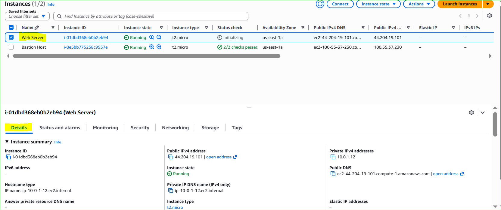
</p>

<p align="center">
  <em>Figure 2: Amazon EC2 Instance Details</em>
</p>

---

# 🧠 Public IPv4 DNS Explanation

The instance is automatically assigned a:

- Public IPv4 DNS

This DNS name allows communication with the EC2 instance directly from the Internet.

Example:

```text
ec2-44-xxx-xxx-xxx.compute-1.amazonaws.com
```

This public DNS can later be used to:

- Access web applications
- Connect using SSH
- Test hosted services

---

# ⚙️ Step 13 — Wait for Instance Initialization

At first, the EC2 instance will appear in the following states:

| State | Description |
|---|---|
| Pending | AWS is launching the instance |
| Initializing | Operating system and services are starting |
| Running | The instance is fully operational |

---

# 🧠 Instance State Explanation

### 🔹 Pending
AWS allocates:
- Virtual hardware
- Storage
- Networking resources

### 🔹 Initializing
Amazon Linux boots and:
- Executes the User Data script
- Starts Apache Web Server
- Configures services

### 🔹 Running
The EC2 instance becomes available for:
- Monitoring
- Remote access
- Web hosting

---

# Running EC2 Instance

<p align="center">
  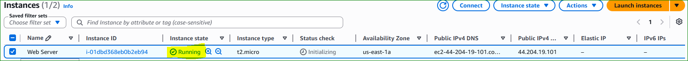
</p>

<p align="center">
  <em>Figure 3: EC2 Instance Running Successfully</em>
</p>

---

# ✅ Verification

Wait until the instance displays the following status:

| Parameter | Status |
|---|---|
| Instance State | Running |
| Status Checks | 2/2 checks passed |

---

# 🧠 Status Checks Explanation

Amazon EC2 automatically performs two health checks:

| Status Check | Description |
|---|---|
| System Status Check | Verifies AWS physical infrastructure |
| Instance Status Check | Verifies the operating system inside the instance |

When both checks pass:

- The AWS infrastructure is healthy
- The operating system is functioning correctly
- The instance is ready for use

---

# Status Checks Passed

<p align="center">
  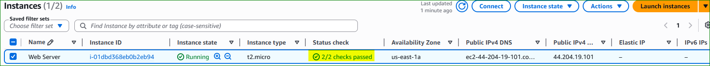
</p>

<p align="center">
  <em>Figure 4: EC2 Status Checks Successfully Passed</em>
</p>

---

# 🎉 Congratulations!


The instance is now:

✅ Running successfully  
✅ Connected to the network  
✅ Protected against accidental termination  
✅ Configured with Apache Web Server  
✅ Ready for monitoring and web access  

---

# ✅ Result

You successfully created and configured an Amazon EC2 instance with:

- Amazon Linux 2023
- Apache Web Server
- User Data Automation
- Public IPv4 Connectivity
- Security Group Configuration
- Termination Protection

The environment is now ready for the next tasks in the lab.

---

# 🌐 Task 2 — Monitor Your Instance

## 📌 Description

Monitoring is an important part of maintaining the:

- Reliability
- Availability
- Performance

of your Amazon EC2 instances and AWS infrastructure.

In this task, you will explore several EC2 monitoring and troubleshooting tools.

---

## ⚙️ Step 1 — Open Status Checks

Select:

- `Web Server` instance

Choose:

- **Status checks** tab

### 🧠 Status Checks Explanation

Amazon EC2 automatically performs health checks on every running instance.

There are two types of status checks:

| Status Check | Description |
|--------------|-------------|
| System Reachability | Verifies AWS infrastructure and hardware |
| Instance Reachability | Verifies the operating system and instance responsiveness |

Both checks must pass successfully.


## ✅ Expected Result

Verify:

| Parameter | Status |
|-----------|--------|
| System Reachability | Passed |
| Instance Reachability | Passed |

This confirms that:
- The AWS infrastructure is healthy
- The operating system is functioning correctly

---

## ⚙️ Step 2 — Open Monitoring Tab

Choose:

- **Monitoring** tab

### 🧠 Monitoring Explanation

The Monitoring tab displays metrics collected by Amazon CloudWatch.

Examples of metrics:
- CPU Utilization
- Network Traffic
- Disk Operations
- Status Check Metrics

Basic monitoring: updates every 5 minutes  
Detailed monitoring: updates every 1 minute

<p align="center">
  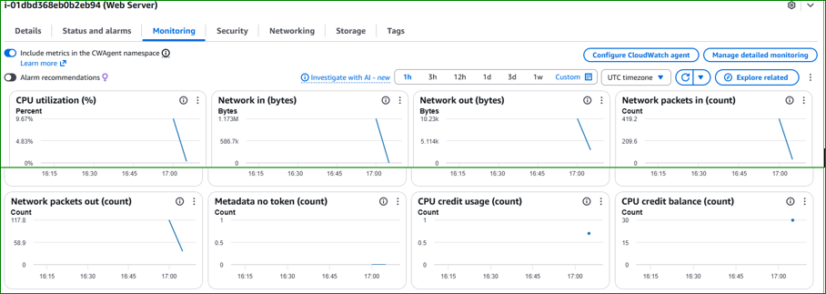
</p>
<p align="center">
  <em>Figure 5: Amazon CloudWatch Monitoring Metrics</em>
</p>

---

## 📌 Expand Monitoring Graphs

To enlarge a graph:
- Click the three dots icon
- Select **Enlarge**

This provides better visibility and detailed metric analysis.

<p align="center">
  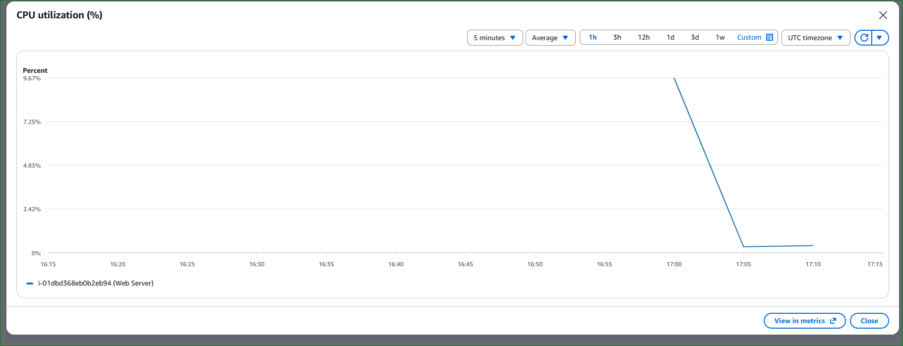
</p>
<p align="center">
  <em>Figure 6: Enlarged CloudWatch Metric Graph</em>
</p>

---

## ⚙️ Step 3 — Open System Log

Choose:
- **Actions**
- **Monitor and troubleshoot**
- **Get system log**

### 🧠 System Log Explanation

The System Log displays:
- Console boot messages
- Kernel logs
- Service startup logs
- Error messages

This tool is extremely useful for:
- Troubleshooting boot problems
- Diagnosing service failures
- Investigating unreachable instances

---

## 📌 Verify Apache Installation

Scroll through the log output and verify:
- HTTP package installation
- Apache service startup

These actions were executed automatically by the User Data script.

# Console Output

<p align="center">
  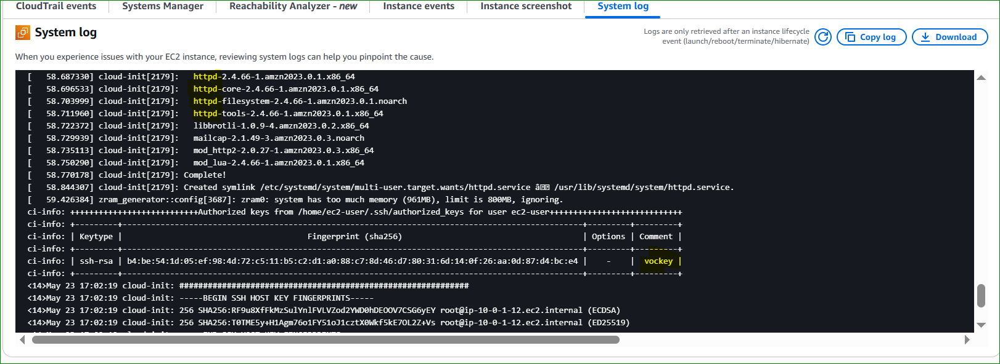
</p>

<p align="center">
  <em>Figure 5: EC2 Console Output Showing Apache Installation</em>
</p>

---

## ⚙️ Step 4 — Get Instance Screenshot

Choose:
- **Actions**
- **Monitor and troubleshoot**
- **Get instance screenshot**

### 🧠 Instance Screenshot Explanation

The instance screenshot displays the console screen of the virtual machine.

This feature is useful when:
- SSH access fails
- RDP access fails
- The operating system crashes
- The server becomes unresponsive

It helps administrators visually diagnose problems.

<p align="center">
  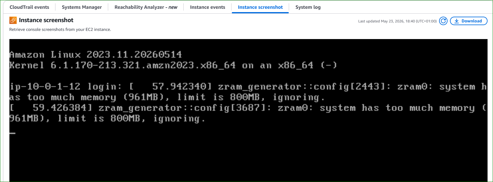
</p>
<p align="center">
  <em>Figure 5: Amazon EC2 Console Screenshot</em>
</p>

---

## 🧠 Screenshot Analysis

The screenshot shows:
- Amazon Linux 2023 boot screen
- Linux kernel version
- System service messages
- Console login prompt

This confirms that:
- The operating system booted successfully
- The EC2 instance is operational

---

## ✅ Result

You successfully explored multiple EC2 monitoring tools:

- Status Checks
- CloudWatch Metrics
- System Logs
- Instance Screenshot

These tools are essential for:
- Troubleshooting
- Monitoring performance
- Diagnosing failures
- Maintaining AWS infrastructure

---

## 🎓 Conclusion

Amazon EC2 monitoring capabilities provide administrators with powerful tools to:
- Observe instance health
- Detect failures
- Analyze performance
- Troubleshoot operating system problems

Monitoring is a critical component of cloud infrastructure management and cybersecurity operations.

---
# 🌐 Task 3 — Update Your Security Group and Access the Web Server

## 📌 Description

When you launched the EC2 instance, you configured a User Data script that:

- Installed Apache Web Server
- Started the HTTP service
- Created a simple web page

In this task, you will:

- Access the EC2 web server
- Configure the Security Group
- Allow HTTP traffic on port 80

---

# ⚙️ Step 1 — Open EC2 Instance Details

Ensure the instance:

- `Web Server`

is still selected.

Choose:

- **Details** tab

---

# ⚙️ Step 2 — Copy Public IPv4 Address

Copy:

- Public IPv4 address

Example:

```text
44.xxx.xxx.xxx
```

The public IPv4 address allows internet communication with the EC2 instance.

---

# Public IPv4 Address

<p align="center">
  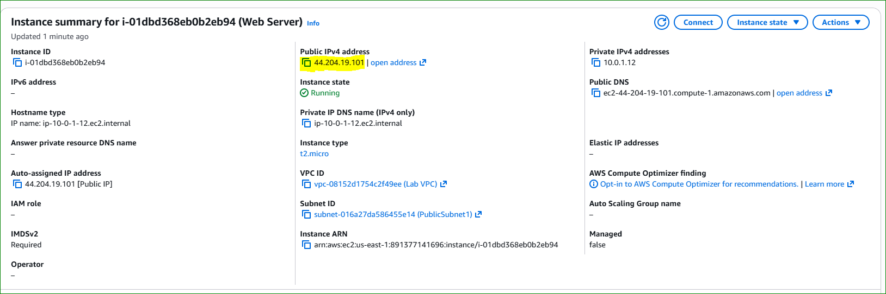
</p>

<p align="center">
  <em>Figure 2: EC2 Public IPv4 Address</em>
</p>

---

# ⚙️ Step 3 — Test Web Server Access

Open:

- A new browser tab

Paste:

- The copied Public IPv4 address

Press:

- **Enter**

---

# ❓ Question

Are you able to access your web server?

---

# ❌ Result

No, the web server is not accessible yet.

---

# 🧠 Why?

The Security Group currently blocks:

- Inbound HTTP traffic on port `80`

Port `80` is used for:

- HTTP web requests

Since no inbound HTTP rule exists, the Security Group denies incoming browser requests.

This demonstrates how AWS Security Groups function as virtual firewalls.

---

# Access Denied by Security Group

<p align="center">
  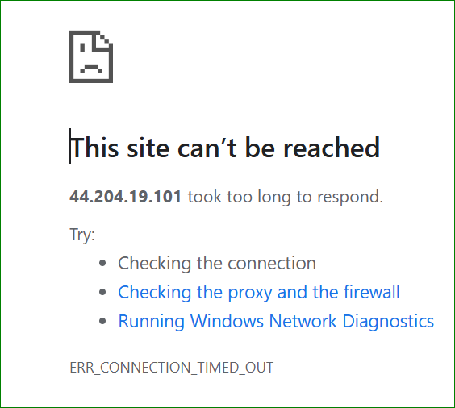
</p>

<p align="center">
  <em>Figure 3: HTTP Access Blocked by the Security Group</em>
</p>

---

# 🧠 Security Group Firewall Explanation

AWS Security Groups help protect EC2 instances by controlling:

- Allowed inbound traffic
- Allowed outbound traffic

Currently:

| Traffic Type | Status |
|---|---|
| HTTP (Port 80) | Blocked |
| HTTPS (Port 443) | Blocked |
| SSH (Port 22) | Removed |

Because HTTP traffic is blocked:

- The Apache web server cannot be reached from the internet

---

# ⚙️ Step 4 — Open Security Groups

Keep the browser tab open and return to:

- EC2 Console

In the left navigation pane choose:

- **Security Groups**

---

# Security Groups Menu

<p align="center">
  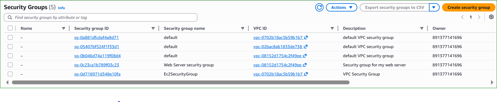
</p>

<p align="center">
  <em>Figure 4: EC2 Security Groups Menu</em>
</p>

---

# ⚙️ Step 5 — Select Web Server Security Group

Select:

- `Web Server security group`

Choose:

- **Inbound rules** tab

Notice:

- No inbound rules currently exist

---

# Empty Inbound Rules

<p align="center">
  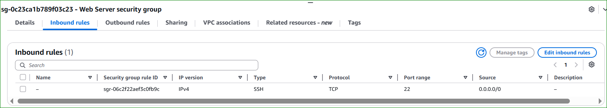
</p>

<p align="center">
  <em>Figure 5: Empty Inbound Security Group Rules</em>
</p>

---

# ⚙️ Step 6 — Add HTTP Rule

Choose:

- **Edit inbound rules**

Then:

- Select **Add rule**

Configure the following:

| Parameter | Value |
|---|---|
| Type | HTTP |
| Protocol | TCP |
| Port Range | 80 |
| Source | Anywhere-IPv4 |

Choose:

- **Save rules**

---

# HTTP Inbound Rule Configuration

<p align="center">
  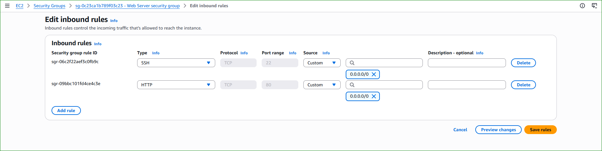
</p>

<p align="center">
  <em>Figure 6: Configuring HTTP Security Group Rule</em>
</p>

---

# 🧠 HTTP Rule Explanation

This rule allows:

- Incoming web traffic on port 80

Source:

```text
0.0.0.0/0
```

Meaning:

- Any IPv4 address on the internet can access the web server

This configuration makes the Apache website publicly accessible.

---

# 🧠 Security Group Analysis

The Security Group now contains the following inbound rule:

| Type | Protocol | Port | Source |
|---|---|---|---|
| HTTP | TCP | 80 | 0.0.0.0/0 |

---

# Security Group Rule Analysis

<p align="center">
  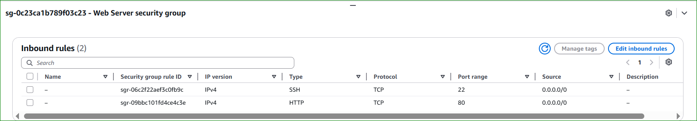
</p>

<p align="center">
  <em>Figure 7: Security Group Allowing HTTP Traffic</em>
</p>

---

# ⚙️ Step 7 — Refresh the Web Browser

Return to:

- The web browser tab previously opened

Refresh the page.

---

# ✅ Web Server Accessible

You should now see the following message:

```html
Hello From Your Web Server!
```

This confirms that:

- Apache Web Server is running successfully
- HTTP traffic is allowed through the Security Group
- The EC2 instance is accessible from the internet

---

# Apache Web Server Output

<p align="center">
  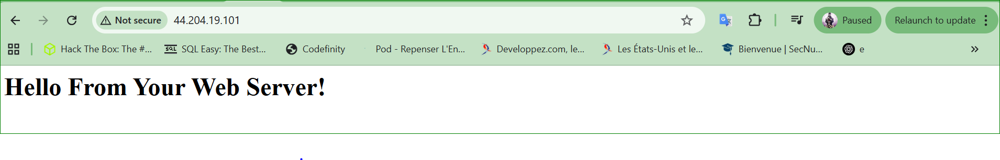
</p>

<p align="center">
  <em>Figure 8: Apache Web Server Successfully Accessible</em>
</p>

---

# 🌐 HTTP Connectivity Flow

The web request now follows this path:

```text
User Browser
      ↓
Internet
      ↓
AWS Security Group
      ↓
HTTP Port 80 Allowed
      ↓
Amazon EC2 Instance
      ↓
Apache Web Server
      ↓
Web Page Response
```

---

# 📌 Important Security Note

Allowing:

```text
0.0.0.0/0
```

provides public internet access.

In production environments, administrators should:

- Restrict unnecessary access
- Use HTTPS instead of HTTP
- Configure AWS WAF protections
- Monitor traffic using CloudWatch and VPC Flow Logs

---

# ✅ Result

You successfully:

✅ Modified the Security Group  
✅ Allowed inbound HTTP traffic on port 80  
✅ Accessed the EC2 web server  
✅ Verified Apache Web Server functionality  
✅ Published a web application on AWS  

---

# 🎓 Conclusion

This task demonstrated how AWS Security Groups function as virtual firewalls to protect EC2 instances.

You learned how to:

- Control inbound traffic
- Allow HTTP access
- Publish a web application securely
- Verify internet connectivity to EC2 instances

Security Groups are one of the most important security mechanisms in AWS cloud environments.

---
# ⚙️ Task 4 — Resize Your EC2 Instance: Instance Type and EBS Volume

---

# 📌 Description

As your application requirements grow, you may need to increase the performance and storage capacity of your Amazon EC2 instance.

In this task, you will:

- Stop the EC2 instance
- Change the instance type
- Enable Stop Protection
- Resize the EBS root volume
- Restart the EC2 instance

This demonstrates how AWS provides scalable and flexible cloud infrastructure.

---

# 🛑 Step 1 — Stop Your EC2 Instance

Before resizing an EC2 instance, the instance must first be stopped.

When an instance is stopped:

- The operating system shuts down safely
- EC2 compute charges stop
- Amazon EBS storage charges continue

---

## 📌 Procedure

- Open the EC2 Management Console
- In the left navigation pane, choose:
  - **Instances**
- Select:
  - `Web Server`
- Open:
  - **Instance state**
- Choose:
  - **Stop instance**

---

# Stop EC2 Instance

<p align="center">
  
</p>

<p align="center">
  <em>Figure 1: Stopping the EC2 Web Server Instance</em>
</p>

---

# ⚠️ Confirm Stop Action

Choose:

- **Stop**

The EC2 instance will perform a normal operating system shutdown.

---

# Instance State — Stopped

<p align="center">
  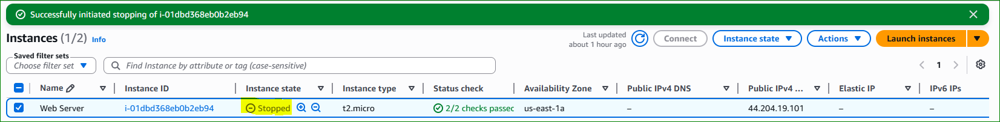
</p>

<p align="center">
  <em>Figure 2: EC2 Instance Successfully Stopped</em>
</p>

---

# ✅ Verification

Wait until:

| Parameter | Status |
|---|---|
| Instance State | Stopped |

---

# 🔄 Step 2 — Change the Instance Type

After the instance is stopped, you can modify the virtual hardware configuration.

---

## 📌 Procedure

- Select:
  - `Web Server`
- Open:
  - **Actions**
  - **Instance settings**
  - **Change instance type**

Configure:

| Parameter | Value |
|---|---|
| Instance Type | t2.small |

Choose:

- **Apply**

---

# Change Instance Type

<p align="center">
  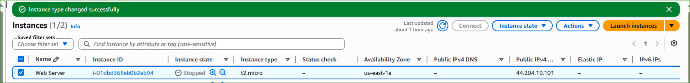
</p>

<p align="center">
  <em>Figure 3: Changing the EC2 Instance Type</em>
</p>

---

# 🧠 Instance Type Explanation

### 🔹 t2.micro

- 1 vCPU
- 1 GiB RAM

### 🔹 t2.small

- 1 vCPU
- 2 GiB RAM

The upgraded instance provides:

- More available memory
- Better application performance
- Improved scalability

> NOTE: Some AWS Academy labs restrict the available instance types.

---

# 🔐 Step 3 — Enable Stop Protection

Stop Protection prevents the EC2 instance from being stopped accidentally.

---

## 📌 Procedure

- Select:
  - `Web Server`
- Open:
  - **Actions**
  - **Instance settings**
  - **Change stop protection**

Configure:

- ✅ Enable Stop Protection

Choose:

- **Save**

---

# Enable Stop Protection

<p align="center">
  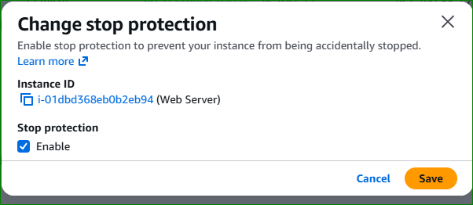
</p>

<p align="center">
  <em>Figure 4: Enabling EC2 Stop Protection</em>
</p>

---

# 🧠 Stop Protection Explanation

When Stop Protection is enabled:

- AWS blocks stop requests
- The instance cannot be stopped accidentally

This feature is useful for:

- Production servers
- Critical applications
- Important infrastructure services

---

# 📌 Important Note

When an EC2 instance is stopped and restarted:

- It may be migrated to another physical AWS host
- A new Public IPv4 address is usually assigned
- The Private IPv4 address remains unchanged
- Attached EBS volumes and stored data are retained

---

# 💾 Step 4 — Resize the Amazon EBS Volume

Amazon EC2 instances use Amazon Elastic Block Store (EBS) for persistent storage.

The current root volume size is:

- `8 GiB`

You will increase it to:

- `10 GiB`

---

## 📌 Procedure

- Keep the `Web Server` instance selected
- Open the:
  - **Storage** tab
- Select the:
  - **Volume ID**
- Select the volume checkbox

Open:

- **Actions**
- **Modify volume**

---

# Open EBS Volume

<p align="center">
  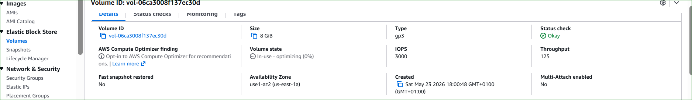
</p>

<p align="center">
  <em>Figure 5: Accessing the Root EBS Volume</em>
</p>

---

# 📌 Modify Volume Size

Configure:

| Parameter | Value |
|---|---|
| Size | 10 GiB |

Choose:

- **Modify**

Then confirm by selecting:

- **Modify** again

---

# Modify EBS Volume

<p align="center">
  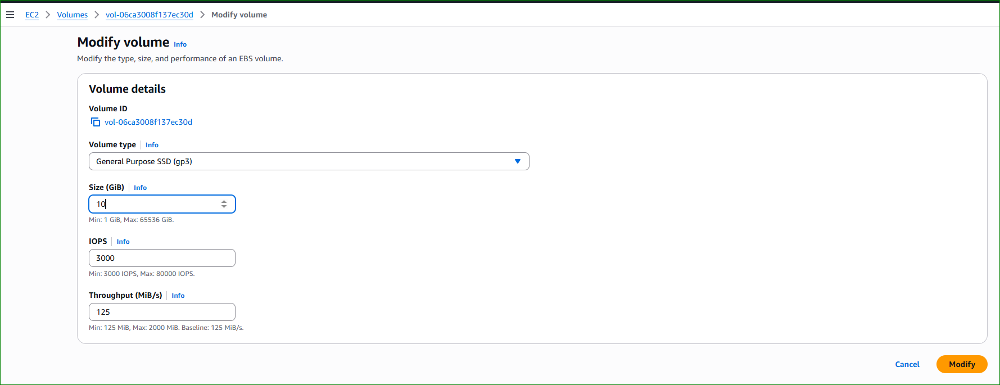
</p>

<p align="center">
  <em>Figure 6: Increasing the EBS Volume Size</em>
</p>

---

# 🧠 EBS Volume Explanation

Amazon EBS provides:

- Persistent block storage
- High durability
- Flexible storage resizing

The EBS root volume stores:

- Operating system files
- Installed applications
- Web server data
- System logs

Increasing the volume size allows:

- More storage capacity
- Better scalability
- Additional space for applications and logs

> NOTE: This lab may restrict EBS volumes larger than 10 GiB.

---

# ▶️ Step 5 — Start the Resized Instance

You will now restart the EC2 instance with the upgraded resources.

---

## 📌 Procedure

- In the left navigation pane, choose:
  - **Instances**
- Select:
  - `Web Server`
- Open:
  - **Instance state**
- Choose:
  - **Start instance**

---

# Start EC2 Instance

<p align="center">
  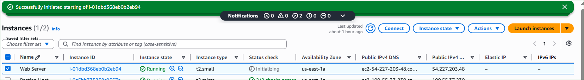
</p>

<p align="center">
  <em>Figure 7: Starting the Resized EC2 Instance</em>
</p>

---

# ✅ Verification

Wait until:

| Parameter | Status |
|---|---|
| Instance State | Running |
| Status Checks | 2/2 checks passed |

---

# Resized EC2 Instance Running

<p align="center">
  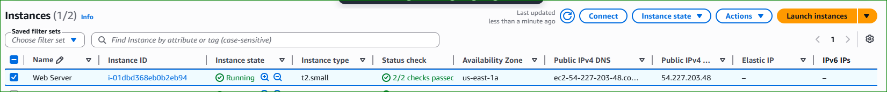
</p>

<p align="center">
  <em>Figure 8: Resized EC2 Instance Running Successfully</em>
</p>

---

# 🧠 Summary

In this task, you successfully:

✅ Stopped the EC2 instance  
✅ Changed the instance type from `t2.micro` to `t2.small`  
✅ Enabled Stop Protection  
✅ Increased the EBS root volume from `8 GiB` to `10 GiB`  
✅ Restarted the EC2 instance successfully  

---

# 🎯 Result

Your EC2 instance now provides:

- More memory
- Additional storage space
- Better scalability
- Improved performance
- Additional protection against accidental shutdowns

---

# 🎓 Conclusion

Amazon EC2 provides flexible scalability features that allow administrators to:

- Resize compute resources dynamically
- Increase storage capacity easily
- Protect critical instances
- Adapt infrastructure to changing workloads

These capabilities are essential in cloud computing, DevOps, and cybersecurity environments.

---
