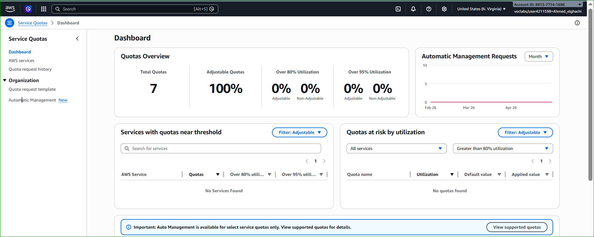
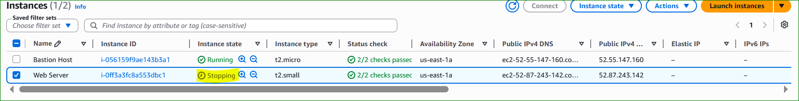

# 🌐 AWS Lab 3 – Introduction to Amazon EC2

---

# 📌 Lab Overview and Objectives

---

# 🧠 Introduction

This lab provides a practical introduction to launching, managing, resizing, and monitoring an Amazon EC2 instance.

Amazon Elastic Compute Cloud (Amazon EC2) is a web service that provides resizable compute capacity in the cloud. It is designed to make web-scale cloud computing easier for developers.

Amazon EC2 provides a simple web service interface that allows users to:
- Launch virtual servers quickly
- Configure computing resources easily
- Scale infrastructure dynamically
- Manage cloud servers efficiently

Amazon EC2 gives you complete control over your computing resources and allows you to run applications on Amazon’s highly reliable cloud infrastructure.

One of the major advantages of Amazon EC2 is its flexibility:
- You can increase or decrease resources at any time
- You only pay for the resources you use
- You can deploy applications within minutes

Amazon EC2 also helps developers build highly available and fault-tolerant applications while reducing infrastructure costs.

---

# 🧠 Architectural Diagram

<p align="center">
  
</p>

<p align="center">
  <em>Figure 1: Amazon EC2 Web Server Architecture</em>
</p>

---

# 🎯 Lab Objectives

After completing this lab, you will be able to:

---

## ✅ Launch a Web Server with Termination Protection Enabled

You will create and configure an Amazon EC2 instance running a web server while enabling termination protection to prevent accidental deletion.

---

## ✅ Monitor Your EC2 Instance

You will use monitoring tools such as:
- Status Checks
- CloudWatch Metrics
- System Logs
- Instance Screenshots

to observe the health and performance of your instance.

---

## ✅ Modify the Security Group to Allow HTTP Access

You will configure inbound security group rules to allow web traffic on port 80 (HTTP) so users can access the hosted web application.

---

## ✅ Resize Your Amazon EC2 Instance

You will:
- Change the EC2 instance type
- Increase computing resources
- Modify the EBS storage volume size

This demonstrates how AWS supports scalability.

---

## ✅ Enable and Test Stop Protection

You will enable stop protection to prevent accidental stopping of your EC2 instance and test how this protection works.

---

## ✅ Explore Amazon EC2 Limits

You will use AWS Service Quotas to explore:
- EC2 instance limits
- Running instance quotas
- Resource limitations per region

---

## ✅ Stop Your EC2 Instance

You will safely stop your EC2 instance after disabling stop protection.

---


# ⏱️ Duration

Approximate time: 35 minutes

---

# 🌐 Task 1 — Launch Your Amazon EC2 Instance

---

# 📌 Description

In this task, you will launch an Amazon EC2 instance with:

- Termination Protection
- Stop Protection
- User Data Script
- Apache Web Server

The EC2 instance will host a simple web application accessible from the internet.

---

# ⚙️ Step 1 — Open EC2 Console

- Open AWS Management Console
- Choose **Services**
- Select **Compute**
- Choose **EC2**

Verify the region:
- `N. Virginia (us-east-1)`

---

# EC2 Console

<p align="center">
  
</p>

<p align="center">
  <em>Figure 1: Amazon EC2 Console Dashboard</em>
</p>

---

# ⚙️ Step 2 — Launch Instance

- Click **Launch instance**
- Select **Launch instance**

---

# Launch Instance Menu

<p align="center">
  
</p>

<p align="center">
  <em>Figure 2: Launch Instance Menu</em>
</p>

---

# ⚙️ Step 3 — Configure Name and Tags

Set the instance name:

- `Web Server`

AWS automatically creates a tag:

| Key | Value |
|---|---|
| Name | Web Server |

Tags help organize AWS resources.

---

# Name and Tags Configuration

<p align="center">
  
</p>

<p align="center">
  <em>Figure 3: EC2 Name and Tags Configuration</em>
</p>

---

# ⚙️ Step 4 — Choose Amazon Machine Image (AMI)

Keep the default selections:

- Amazon Linux
- Amazon Linux 2023 AMI

---

# 🧠 AMI Explanation

An Amazon Machine Image (AMI) provides:
- Operating System
- Software packages
- Storage configuration
- Launch permissions

The AMI acts as the template for the EC2 instance.

---

# Amazon Linux AMI

<p align="center">
  
</p>

<p align="center">
  <em>Figure 4: Amazon Linux 2023 AMI</em>
</p>

---

# ⚙️ Step 5 — Choose Instance Type

Keep default instance type:

- `t2.micro`

Specifications:
- 1 vCPU
- 1 GiB RAM

---

# 🧠 Instance Type Explanation

Amazon EC2 instance types define:
- CPU resources
- Memory capacity
- Storage performance
- Network performance

The `t2.micro` instance is ideal for lightweight workloads and AWS labs.

---

# Instance Type Selection

<p align="center">
  
</p>

<p align="center">
  <em>Figure 5: EC2 Instance Type Selection</em>
</p>

---

# ⚙️ Step 6 — Configure Key Pair

Select:
- `vockey`

---

# 🧠 Key Pair Explanation

AWS uses public-key cryptography for secure authentication.

The key pair allows:
- Secure SSH access
- Secure instance authentication

In this lab, the key pair is required even if SSH is not used.

---

# Key Pair Configuration

<p align="center">
  
</p>

<p align="center">
  <em>Figure 6: EC2 Key Pair Configuration</em>
</p>

---

# ⚙️ Step 7 — Configure Network Settings

Choose:
- VPC: `Lab VPC`
- Subnet: `PublicSubnet1`

Keep:
- Auto-assign Public IP enabled

---

# 🌐 Configure Security Group

Choose:
- Create security group

Configure:

| Parameter | Value |
|---|---|
| Security Group Name | Web Server security group |
| Description | Security group for my web server |

Remove the default inbound SSH rule.

---

# 🧠 Security Group Explanation

A security group acts as a virtual firewall.

It controls:
- Inbound traffic
- Outbound traffic

Currently:
- No inbound rules are configured
- HTTP access will be added later

---

# Network Settings Configuration

<p align="center">
  
</p>

<p align="center">
  <em>Figure 7: EC2 Network and Security Group Configuration</em>
</p>

---

# ⚙️ Step 8 — Configure Storage

Keep default storage settings:

| Volume Type | Size |
|---|---|
| gp3 SSD | 8 GiB |

---

# 🧠 Storage Explanation

Amazon EC2 uses:
- Amazon Elastic Block Store (EBS)

The root volume:
- Stores the operating system
- Stores applications and data

---

# Storage Configuration

<p align="center">
  
</p>

<p align="center">
  <em>Figure 8: EC2 Storage Configuration</em>
</p>

---

# ⚙️ Step 9 — Configure Advanced Details

Expand:
- Advanced details

Enable:
- Termination Protection

---

# 🧠 Termination Protection

Termination protection prevents accidental deletion of the EC2 instance.

When enabled:
- The instance cannot be terminated unless protection is disabled first.

---

# Advanced Details

<p align="center">
  
</p>

<p align="center">
  <em>Figure 9: Advanced Details Configuration</em>
</p>

---

# ⚙️ Step 10 — Configure User Data Script

Paste the following script into the **User data** field:

```bash
#!/bin/bash

dnf install -y httpd

systemctl enable httpd

systemctl start httpd

echo '<html><h1>Hello From Your Web Server!</h1></html>' > /var/www/html/index.html
```

---

# 🧠 User Data Script Explanation

This script automatically:

- Installs Apache Web Server
- Starts Apache service
- Enables Apache at boot
- Creates a simple web page

The script executes automatically when the instance launches for the first time.

---

# User Data Script

<p align="center">
  
</p>

<p align="center">
  <em>Figure 10: EC2 User Data Script Configuration</em>
</p>

---

# ⚙️ Step 11 — Launch the Instance

At the bottom of the Summary panel:

- Click **Launch instance**

You should see:
- Success message

---

# Launch Success

<p align="center">
  
</p>

<p align="center">
  <em>Figure 11: EC2 Instance Launch Success</em>
</p>

---

# ⚙️ Step 12 — View All Instances

Choose:
- View all instances

Select:
- `Web Server`

Review:
- Instance details
- Security settings
- Network configuration
- Public IPv4 DNS

---

# EC2 Instance Details

<p align="center">
  
</p>

<p align="center">
  <em>Figure 12: EC2 Instance Details</em>
</p>

---

# ⚙️ Step 13 — Wait for Instance Initialization

The instance status will progress through:

| State | Description |
|---|---|
| Pending | Instance is launching |
| Initializing | Services are starting |
| Running | Instance is operational |

Wait until:

| Parameter | Status |
|---|---|
| Instance State | Running |
| Status Checks | 2/2 checks passed |

---

# Running EC2 Instance

<p align="center">
  
</p>

<p align="center">
  <em>Figure 13: Running EC2 Instance</em>
</p>

---

# ✅ Result

You successfully launched an Amazon EC2 instance with:

- Amazon Linux 2023
- Apache Web Server
- Termination Protection
- Public IP Address
- User Data Automation

The EC2 instance is now ready for monitoring and web access configuration.

---
# 🌐 Task 2 — Monitor Your Instance

---

# 📌 Description

Monitoring is an important part of maintaining the:

- Reliability
- Availability
- Performance

of your Amazon EC2 instances and AWS infrastructure.

In this task, you will explore several EC2 monitoring and troubleshooting tools.

---

# ⚙️ Step 1 — Open Status Checks

Select:
- `Web Server` instance

Choose:
- Status checks tab

---

# 🧠 Status Checks Explanation

Amazon EC2 automatically performs health checks on every running instance.

There are two types of status checks:

| Status Check | Description |
|---|---|
| System Reachability | Verifies AWS infrastructure and hardware |
| Instance Reachability | Verifies the operating system and instance responsiveness |

Both checks must pass successfully.

---

# Status Checks

<p align="center">
  
</p>

<p align="center">
  <em>Figure 1: EC2 Instance Status Checks</em>
</p>

---

# ✅ Expected Result

Verify:

| Parameter | Status |
|---|---|
| System Reachability | Passed |
| Instance Reachability | Passed |

This confirms that:
- The AWS infrastructure is healthy
- The operating system is functioning correctly

---

# ⚙️ Step 2 — Open Monitoring Tab

Choose:
- Monitoring tab

---

# 🧠 Monitoring Explanation

The Monitoring tab displays metrics collected by:
- Amazon CloudWatch

Examples of metrics:
- CPU Utilization
- Network Traffic
- Disk Operations
- Status Check Metrics

Basic monitoring:
- Updates every 5 minutes

Detailed monitoring:
- Updates every 1 minute

---

# CloudWatch Monitoring Metrics

<p align="center">
  
</p>

<p align="center">
  <em>Figure 2: Amazon CloudWatch Monitoring Metrics</em>
</p>

---

# 📌 Expand Monitoring Graphs

To enlarge a graph:

- Click the three dots icon
- Select Enlarge

This provides:
- Better visibility
- Detailed metric analysis

---

# Enlarged CloudWatch Graph

<p align="center">
  
</p>

<p align="center">
  <em>Figure 3: Enlarged CloudWatch Metric Graph</em>
</p>

---

# ⚙️ Step 3 — Open System Log

Choose:
- Actions
- Monitor and troubleshoot
- Get system log

---

# 🧠 System Log Explanation

The System Log displays:
- Console boot messages
- Kernel logs
- Service startup logs
- Error messages

This tool is extremely useful for:
- Troubleshooting boot problems
- Diagnosing service failures
- Investigating unreachable instances

---

# 📌 Verify Apache Installation

Scroll through the log output and verify:
- HTTP package installation
- Apache service startup

These actions were executed automatically by the User Data script.

---

# System Log Output

<p align="center">
  
</p>

<p align="center">
  <em>Figure 4: EC2 System Log Output</em>
</p>

---

# ⚙️ Step 4 — Get Instance Screenshot

Choose:
- Actions
- Monitor and troubleshoot
- Get instance screenshot

---

# 🧠 Instance Screenshot Explanation

The instance screenshot displays the console screen of the virtual machine.

This feature is useful when:
- SSH access fails
- RDP access fails
- The operating system crashes
- The server becomes unresponsive

It helps administrators visually diagnose problems.

---

# EC2 Instance Screenshot

<p align="center">
  
</p>

<p align="center">
  <em>Figure 5: Amazon EC2 Console Screenshot</em>
</p>

---

# 📌 Example Console Screenshot

<p align="center">
  
</p>

<p align="center">
  <em>Figure 6: Linux Console Output from EC2 Instance</em>
</p>

---

# 🧠 Screenshot Analysis

The screenshot shows:
- Amazon Linux 2023 boot screen
- Linux kernel version
- System service messages
- Console login prompt

This confirms that:
- The operating system booted successfully
- The EC2 instance is operational

---

# ✅ Result

You successfully explored multiple EC2 monitoring tools:

- Status Checks
- CloudWatch Metrics
- System Logs
- Instance Screenshot

These tools are essential for:
- Troubleshooting
- Monitoring performance
- Diagnosing failures
- Maintaining AWS infrastructure

---

# 🎓 Conclusion

Amazon EC2 monitoring capabilities provide administrators with powerful tools to:
- Observe instance health
- Detect failures
- Analyze performance
- Troubleshoot operating system problems

Monitoring is a critical component of cloud infrastructure management and cybersecurity operations.

---
# 🌐 Task 3 — Update Your Security Group and Access the Web Server

---

# 📌 Description

When you launched the EC2 instance, you configured a User Data script that:

- Installed Apache Web Server
- Started the HTTP service
- Created a simple web page

In this task, you will:
- Access the EC2 web server
- Configure the Security Group
- Allow HTTP traffic on port 80

---

# ⚙️ Step 1 — Open EC2 Instance Details

Ensure the instance:
- `Web Server`

is selected.

Choose:
- Details tab

---

# EC2 Instance Details

<p align="center">
  
</p>

<p align="center">
  <em>Figure 1: EC2 Instance Details</em>
</p>

---

# ⚙️ Step 2 — Copy Public IPv4 Address

Copy:
- Public IPv4 address

Example:

```text
44.xxx.xxx.xxx
```

This public IP allows internet access to the EC2 instance.

---

# Public IPv4 Address

<p align="center">
  
</p>

<p align="center">
  <em>Figure 2: EC2 Public IPv4 Address</em>
</p>

---

# ⚙️ Step 3 — Test Web Server Access

Open:
- A new browser tab

Paste:
- The Public IPv4 address

Press:
- Enter

---

# ❓ Question

Are you able to access the web server?

---

# ❌ Result

No, the web server is not accessible.

---

# 🧠 Why?

The Security Group currently blocks:
- Inbound HTTP traffic on port 80

The Security Group acts as a firewall and only permits allowed traffic.

Since no HTTP rule exists:
- Browser requests are denied

---

# Access Denied

<p align="center">
  
</p>

<p align="center">
  <em>Figure 3: HTTP Access Blocked by Security Group</em>
</p>

---

# ⚙️ Step 4 — Open Security Groups

Return to:
- EC2 Console

In the left navigation pane choose:
- Security Groups

---

# Security Groups Menu

<p align="center">
  
</p>

<p align="center">
  <em>Figure 4: EC2 Security Groups</em>
</p>

---

# ⚙️ Step 5 — Select Web Server Security Group

Select:
- `Web Server security group`

Choose:
- Inbound rules tab

Notice:
- No inbound rules exist

---

# Security Group Rules

<p align="center">
  
</p>

<p align="center">
  <em>Figure 5: Empty Inbound Security Group Rules</em>
</p>

---

# ⚙️ Step 6 — Add HTTP Rule

Choose:
- Edit inbound rules

Then:
- Add rule

Configure:

| Parameter | Value |
|---|---|
| Type | HTTP |
| Source | Anywhere-IPv4 |

Choose:
- Save rules

---

# 🧠 HTTP Rule Explanation

The HTTP rule allows:
- Web traffic on port 80

Source:
- `0.0.0.0/0`

Meaning:
- Any device on the internet can access the web server

---

# HTTP Inbound Rule

<p align="center">
  
</p>

<p align="center">
  <em>Figure 6: HTTP Inbound Rule Configuration</em>
</p>

---

# ⚙️ Step 7 — Refresh the Web Browser

Return to:
- Browser tab

Refresh the page.

---

# ✅ Web Server Accessible

You should now see:

```html
Hello From Your Web Server!
```

---

# Apache Web Server Output

<p align="center">
  
</p>

<p align="center">
  <em>Figure 7: Apache Web Server Successfully Accessible</em>
</p>

---

# 🧠 Security Group Analysis

The Security Group now permits:

| Protocol | Port | Access |
|---|---|---|
| HTTP | 80 | Anywhere IPv4 |

This allows users on the internet to access the hosted web application.

---

# ✅ Result

You successfully:

- Modified the Security Group
- Allowed HTTP traffic
- Accessed the EC2 web server
- Verified Apache Web Server functionality

---

# 🎓 Conclusion

This task demonstrated how AWS Security Groups act as virtual firewalls to protect EC2 instances.

You learned how to:
- Control inbound traffic
- Permit HTTP access
- Publish a web server securely on AWS

Security Groups are one of the most important security mechanisms in AWS cloud environments.

---
# ⚙️ Task 4 — Resize Your Instance: Instance Type and EBS Volume

As your application requirements grow, you may need to increase the performance of your EC2 instance or expand its storage capacity.

In this task, you will:
- Stop the EC2 instance
- Change the instance type
- Enable Stop Protection
- Resize the EBS volume
- Restart the instance

---

# 🛑 Step 1 — Stop the EC2 Instance

Before resizing an EC2 instance, it must first be stopped.

When an instance is stopped:
- The operating system shuts down safely
- Compute charges stop
- EBS storage charges continue

---

## 📌 Procedure

- Open the EC2 Console
- In the left menu, choose **Instances**
- Select the instance: `Web Server`
- Click **Instance state**
- Choose **Stop instance**

---

# EC2 Instance — Stop Instance

<p align="center">
  
</p>

<p align="center">
  <em>Figure 22: Stopping the EC2 Web Server Instance</em>
</p>

---

# ⚠️ Confirm Stop Action

- Click **Stop**

The instance will begin shutting down.

---

# Instance State — Stopped

<p align="center">
  
</p>

<p align="center">
  <em>Figure 23: EC2 Instance Successfully Stopped</em>
</p>

---

# 🔄 Step 2 — Change Instance Type

Once the instance is stopped, you can resize the virtual hardware.

---

## 📌 Procedure

- Select the `Web Server` instance
- Click:
  - **Actions**
  - **Instance settings**
  - **Change instance type**

Configure:

- Instance Type: `t2.small`

Then click:
- **Apply**

---

# Change Instance Type

<p align="center">
  
</p>

<p align="center">
  <em>Figure 24: Changing EC2 Instance Type to t2.small</em>
</p>

---

# 🧠 Explanation

### 🔹 t2.micro
- 1 vCPU
- 1 GiB RAM

### 🔹 t2.small
- 1 vCPU
- 2 GiB RAM

The upgraded instance provides:
- Better performance
- More available memory
- Improved scalability

---

# 🔐 Step 3 — Enable Stop Protection

Stop protection prevents accidental stopping of the EC2 instance.

---

## 📌 Procedure

- Select the instance
- Click:
  - **Actions**
  - **Instance settings**
  - **Change stop protection**

Enable:
- ✅ Stop Protection

Click:
- **Save**

---

# Enable Stop Protection

<p align="center">
  
</p>

<p align="center">
  <em>Figure 25: Enabling Stop Protection</em>
</p>

---

# 🧠 Explanation

When Stop Protection is enabled:
- The instance cannot be stopped accidentally
- AWS blocks stop requests until protection is disabled

This is useful for:
- Production servers
- Critical services
- Important applications

---

# 💾 Step 4 — Resize the EBS Volume

Amazon EC2 instances use Amazon EBS volumes for persistent storage.

The default root volume size is:
- `8 GiB`

You will increase it to:
- `10 GiB`

---

## 📌 Procedure

- Select the EC2 instance
- Open the **Storage** tab
- Click the **Volume ID**
- Select the EBS volume
- Click:
  - **Actions**
  - **Modify volume**

---

# Open EBS Volume

<p align="center">
  
</p>

<p align="center">
  <em>Figure 26: Accessing the Root EBS Volume</em>
</p>

---

## 📌 Modify Volume Size

Change:
- Size: `10 GiB`

Then click:
- **Modify**

Confirm:
- **Modify**

---

# Modify EBS Volume

<p align="center">
  
</p>

<p align="center">
  <em>Figure 27: Increasing EBS Volume Size from 8 GiB to 10 GiB</em>
</p>

---

# 🧠 Explanation

Amazon EBS (Elastic Block Store):
- Provides persistent block storage
- Stores operating system and application files
- Retains data even if the instance is stopped

Increasing the volume size allows:
- More storage capacity
- Better scalability
- More space for applications and logs

---

# ▶️ Step 5 — Start the Resized Instance

Now restart the EC2 instance.

---

## 📌 Procedure

- Return to **Instances**
- Select `Web Server`
- Click:
  - **Instance state**
  - **Start instance**

---

# Start EC2 Instance

<p align="center">
  
</p>

<p align="center">
  <em>Figure 28: Starting the Resized EC2 Instance</em>
</p>

---

# ✅ Verification

Wait until:
- Instance State = `Running`
- Status Checks = `2/2 checks passed`

---

# Resized EC2 Instance Running

<p align="center">
  
</p>

<p align="center">
  <em>Figure 29: Resized EC2 Instance Running Successfully</em>
</p>

---

# 🧠 Summary

In this task, you successfully:

✅ Stopped the EC2 instance  
✅ Changed the instance type from `t2.micro` to `t2.small`  
✅ Enabled Stop Protection  
✅ Increased EBS volume size from `8 GiB` to `10 GiB`  
✅ Restarted the EC2 instance  

---

# 🎯 Result

Your EC2 instance now has:
- More RAM
- More storage space
- Better performance
- Additional protection against accidental stop actions
---
# 📊 Task 5 — Explore EC2 Limits

Amazon EC2 provides different AWS resources such as:
- EC2 Instances
- AMIs (Amazon Machine Images)
- EBS Volumes
- Snapshots
- Security Groups

Each AWS account has default service quotas (limits) for every AWS Region.

These limits help:
- Protect AWS resources
- Prevent accidental overuse
- Improve cloud stability

---

# 🧭 Step 1 — Open Service Quotas

## 📌 Procedure

- Open the AWS Management Console
- In the search bar next to **Services**
- Search for:
  - `Service Quotas`
- Open the **Service Quotas** console

---

# Service Quotas Console

<p align="center">
  
</p>

<p align="center">
  <em>Figure 30: AWS Service Quotas Dashboard</em>
</p>

---

# 🔍 Step 2 — Select Amazon EC2 Service

## 📌 Procedure

- In the left navigation pane:
  - Choose **AWS services**
- In the search bar:
  - Search for `ec2`
- Select:
  - `Amazon Elastic Compute Cloud (Amazon EC2)`

---

# Select Amazon EC2 Service

<p align="center">
  
</p>

<p align="center">
  <em>Figure 31: Selecting Amazon EC2 in Service Quotas</em>
</p>

---

# 🔎 Step 3 — Search EC2 Running Limits

## 📌 Procedure

In the **Find quotas** search bar:

Search for:
- `running on-demand`

Do not select any quota.

Instead:
- Observe the filtered quota list

---

# EC2 Running On-Demand Limits

<p align="center">
  
</p>

<p align="center">
  <em>Figure 32: EC2 Running On-Demand Instance Limits</em>
</p>

---

# 🧠 Understanding EC2 Limits

AWS applies quotas to:
- Number of EC2 instances
- Volume sizes
- Snapshots
- Elastic IPs
- VPC resources

Example:
- There is a limit on how many **Running On-Demand Standard instances** you can launch in one region.

This means:
- You cannot exceed the allowed number of EC2 instances
- AWS blocks launches beyond the quota

---

# 📌 Common EC2 Limits

| Resource | Example Limit |
|---|---|
| Running EC2 Instances | Limited per region |
| EBS Volumes | Limited quantity |
| Elastic IP Addresses | Limited per account |
| Security Groups | Limited per VPC |
| Snapshots | Limited storage usage |

---

# 🔐 Why AWS Uses Limits

AWS quotas help:
- Prevent accidental resource abuse
- Improve cloud security
- Control billing costs
- Protect AWS infrastructure stability

---

# ⬆️ Requesting Limit Increases

If you are the AWS account owner:
- You can request quota increases
- AWS reviews the request
- Limits can be expanded depending on your needs

Examples:
- More EC2 instances
- Larger EBS storage
- More Elastic IPs

---

# ✅ Result

In this task, you successfully:

✅ Opened the AWS Service Quotas console  
✅ Explored Amazon EC2 service quotas  
✅ Observed EC2 running instance limits  
✅ Learned how AWS controls cloud resource usage  

---
# 🔐 Task 6 — Test Stop Protection

Amazon EC2 provides a feature called **Stop Protection** that prevents an instance from being accidentally stopped.

In this task, you will:
- Test Stop Protection
- Observe the protection error message
- Disable Stop Protection
- Successfully stop the EC2 instance

---

# 🧭 Step 1 — Return to EC2 Console

## 📌 Procedure

- Open the AWS Management Console
- Search for:
  - `EC2`
- Open the **EC2 Console**

---

# EC2 Console

<p align="center">
  
</p>

<p align="center">
  <em>Figure 33: Returning to the Amazon EC2 Console</em>
</p>

---

# 📌 Step 2 — Attempt to Stop the Instance

## Procedure

- In the left navigation pane:
  - Choose **Instances**
- Select:
  - `Web Server`
- Click:
  - **Instance state**
  - **Stop instance**

---

# Attempt to Stop EC2 Instance

<p align="center">
  
</p>

<p align="center">
  <em>Figure 34: Attempting to Stop the Protected EC2 Instance</em>
</p>

---

# ⚠️ Stop Protection Error

Click:
- **Stop**

AWS displays an error message similar to:

```text
Failed to stop the instance i-xxxxxxxx.
The instance may not be stopped.
Modify its 'disableApiStop' attribute and try again.

---
