# Lab 4: Working with EBS

## 📌 Lab Overview

This lab focuses on **Amazon Elastic Block Store (Amazon EBS)**, a key storage service used with Amazon EC2 instances.

In this lab, you will learn how to:

- Create an Amazon EBS volume
- Attach and mount the volume to an EC2 instance
- Create a filesystem on the volume
- Create a snapshot backup
- Restore the snapshot into a new volume

---

# 🧠 Architectural Diagram

<p align="center">
  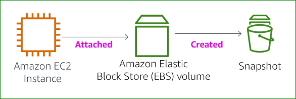
</p>

<p align="center">
  <em>Figure 1: Amazon EBS Architecture with EC2 Instance and Snapshot Workflow</em>
</p>

---

# 🎯 Objectives

By the end of this lab, you will be able to:

- Create an Amazon EBS volume
- Attach and mount the volume to an EC2 instance
- Create a snapshot of the volume
- Restore a volume from a snapshot
- Verify stored data after restoration

---

# 📚 Prerequisites

Before starting this lab, you should be familiar with:

- Basic AWS EC2 usage
- Linux command-line basics
- Filesystem management in Linux

---

# 🔒 AWS Service Restrictions

In this lab environment, access is restricted only to the AWS services required for the lab.

Some AWS actions may not be available.

---

# 📖 What is Amazon EBS?

Amazon Elastic Block Store (EBS) provides persistent block-level storage volumes for use with Amazon EC2 instances.

## Key Features

- Persistent storage
- High availability
- Snapshot backups
- Easy scalability
- High durability
- Independent lifecycle from EC2 instances

---

# ⚙️ Amazon EBS Features

| Feature | Description |
|---|---|
| Persistent Storage | Data survives EC2 stop/start |
| High Performance | SSD-backed storage |
| Reliability | Built-in redundancy |
| Snapshots | Backup volumes to Amazon S3 |
| Scalability | 1 GB to 16 TB |
| Easy Restore | Restore from snapshots |

---

# 🧩 Task 1 — Create a New EBS Volume

## Step 1: Open EC2

- Go to AWS Console
- Search for **EC2**
---

## Step 2: Verify Existing Instance

- Click **Instances**
- Locate the instance named:

```text
Lab
```

- Note the Availability Zone:

Example:

```text
us-east-1a
```

###  EC2 Lab Instance

<p align="center">
  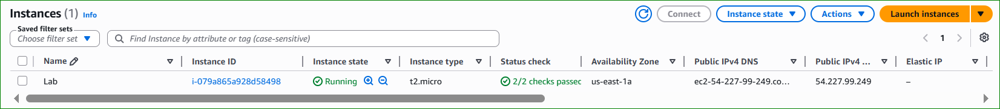
</p>

<p align="center">
  <em>Figure 2: EC2 Lab Instance</em>
</p>

---

## Step 3: Create Volume

Go to:

```text
EC2 → Volumes → Create Volume
```

### Configuration

| Setting | Value |
|---|---|
| Volume Type | General Purpose SSD (gp2) |
| Size | 1 GiB |
| Availability Zone | Same as EC2 instance |

### Create EBS Volume

<p align="center">
  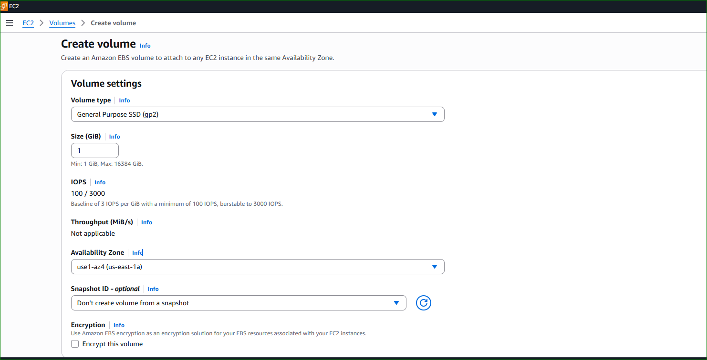
</p>

<p align="center">
  <em>Figure 3: Create EBS Volume</em>
</p>

---

### Add Tag

| Key | Value |
|---|---|
| Name | My Volume |

### Add Volume Tag

<p align="center">
  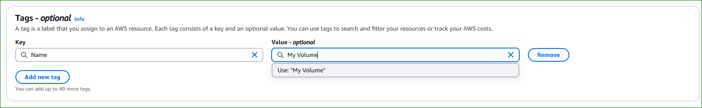
</p>

<p align="center">
  <em>Figure 4: Add Volume Tag</em>
</p>

---

Click:

```text
Create Volume
```

---

# 🔗 Task 2 — Attach Volume to EC2

## Attach the Volume

1. Select:

```text
My Volume
```

2. Click:

```text
Actions → Attach Volume
```
3. Configure:

| Setting | Value |
|---|---|
| Instance | Lab |
| Device Name | /dev/sdb |

### Volume Attachment Configuration

<p align="center">
  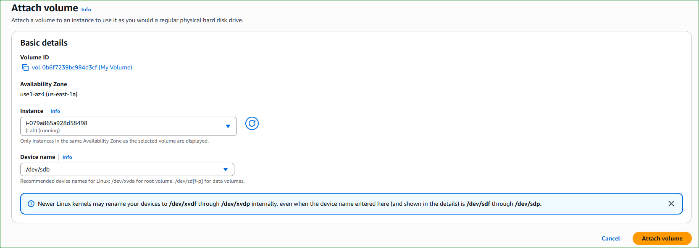
</p>

<p align="center">
  <em>Figure 5: Volume Attachment Configuration</em>
</p>

---

4. Click:

```text
Attach Volume
```

---

# 💻 Task 3 — Connect to EC2

## Use Session Manager

1. Go to:

```text
EC2 → Instances
```

2. Select:

```text
Lab
```

3. Click:

```text
Connect
```

4. Choose:

```text
Session Manager → Connect
```

## Switch User

```text
sudo su -l ec2-user
```

### Switch to ec2-user

<p align="center">
  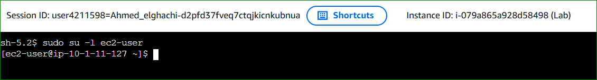
</p>

<p align="center">
  <em>Figure 6: Switch to ec2-user</em>
</p>

---

# 🗂️ Task 4 — Create and Configure File System

## Check Existing Storage

```text
df -h
```

### Check Existing Storage

<p align="center">
  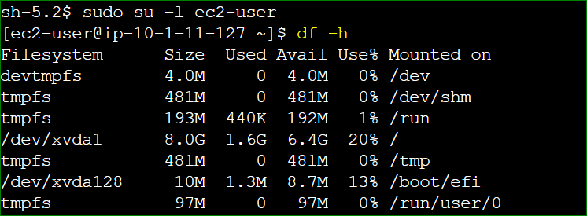
</p>

<p align="center">
  <em>Figure 7: Check Existing Storage</em>
</p>

---

## Create ext3 Filesystem

```text
sudo mkfs -t ext3 /dev/sdb
```

### 
Create ext3 Filesystem

<p align="center">
  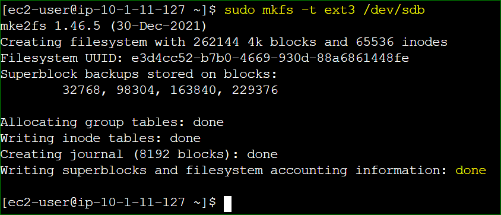
</p>

<p align="center">
  <em>Figure 8: Create ext3 Filesystem</em>
</p>

---

## Create Mount Directory

```text
sudo mkdir /mnt/data-store
```

### Create Mount Directory

<p align="center">
  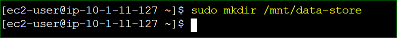
</p>

<p align="center">
  <em>Figure 9: Create Mount Directory</em>
</p>

---

## Mount the Volume

```text
sudo mount /dev/sdb /mnt/data-store
```

###  Mount EBS Volume

<p align="center">
  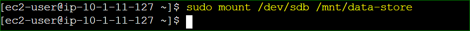
</p>

<p align="center">
  <em>Figure 10: Mount EBS Volume</em>
</p>

---

## Configure Auto-Mount

```text
echo "/dev/sdb   /mnt/data-store ext3 defaults,noatime 1 2" | sudo tee -a /etc/fstab
```

### Configure fstab

<p align="center">
  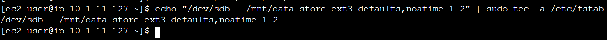
</p>

<p align="center">
  <em>Figure 10: Configure fstab</em>
</p>

---

## Verify fstab

```text
cat /etc/fstab
```

### Verify fstab Configuration

<p align="center">
  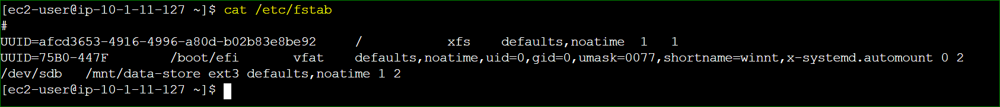
</p>

<p align="center">
  <em>Figure 11: Verify fstab Configuration</em>
</p>

---

## Verify Storage

```text
df -h
```

### Verify Mounted Storage

<p align="center">
  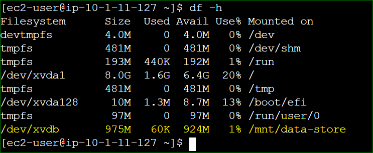
</p>

<p align="center">
  <em>Figure 12: Verify Mounted Storage</em>
</p>

---

## Create Test File

```text
sudo sh -c "echo some text has been written > /mnt/data-store/file.txt"
```

### Create Test File

<p align="center">
  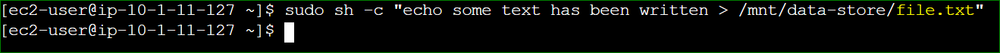
</p>

<p align="center">
  <em>Figure 13: Create Test File</em>
</p>

---

## Verify File

```text
cat /mnt/data-store/file.txt
```


###  Verify File Content

<p align="center">
  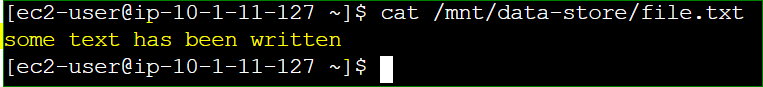
</p>

<p align="center">
  <em>Figure 14: Verify File Content</em>
</p>

---

# 📸 Task 5 — Create an EBS Snapshot

## Create Snapshot

1. Go to:

```text
EC2 → Volumes
```

2. Select:

```text
My Volume
```

3. Click:

```text
Actions → Create Snapshot
```
### Add Tag

| Key | Value |
|---|---|
| Name | My Snapshot |

### Snapshot Tag Configuration

<p align="center">
  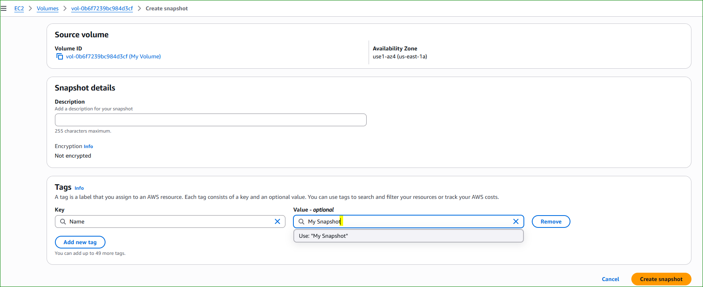
</p>

<p align="center">
  <em>Figure 15: Snapshot Tag Configuration</em>
</p>

---

## Verify Snapshot

Go to:

```text
EC2 → Snapshots
```

Status progression:

```text
Pending → Completed
```

###  Snapshot Completed

<p align="center">
  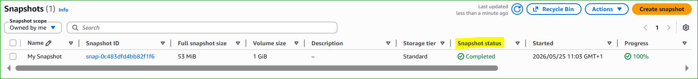
</p>

<p align="center">
  <em>Figure 16: Snapshot Completed</em>
</p>

---

## Delete Test File

```text
sudo rm /mnt/data-store/file.txt
```

### Delete Test File

<p align="center">
  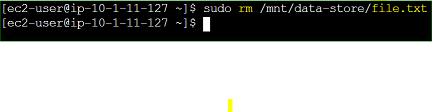
</p>

<p align="center">
  <em>Figure 17: Delete Test File</em>
</p>

---

## Verify Deletion

```text
ls /mnt/data-store/
```

### Verify File Deletion

<p align="center">
  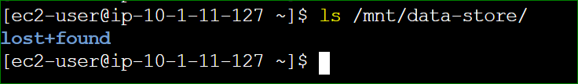
</p>

<p align="center">
  <em>Figure 18: Verify File Deletion</em>
</p>

---

# ♻️ Task 6 — Restore Snapshot

## Create Volume from Snapshot

1. Select:

```text
My Snapshot
```

2. Click:

```text
Actions → Create Volume from Snapshot
```
## Configuration

| Setting | Value |
|---|---|
| Availability Zone | Same as EC2 |

### Add Tag

| Key | Value |
|---|---|
| Name | Restored Volume |

### Restored Volume Tag

<p align="center">
  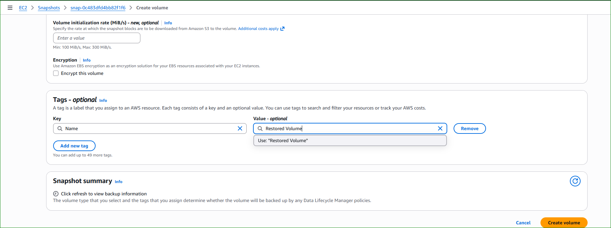
</p>

<p align="center">
  <em>Figure 19: Restored Volume Tag</em>
</p>

---

# 🔗 Attach Restored Volume

1. Go to:

```text
EC2 → Volumes
```

2. Select:

```text
Restored Volume
```

3. Click:

```text
Actions → Attach Volume
```
## Configuration

| Setting | Value |
|---|---|
| Instance | Lab |
| Device Name | /dev/sdc |

---

# 🗂️ Mount Restored Volume

## Create Directory

```text
sudo mkdir /mnt/data-store2
```

### Create Second Mount Directory

<p align="center">
  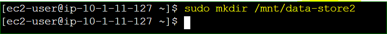
</p>

<p align="center">
  <em>Figure 20: Create Second Mount Directory</em>
</p>

---

## Mount Volume

```text
sudo mount /dev/sdc /mnt/data-store2
```

### Mount Restored Volume

<p align="center">
  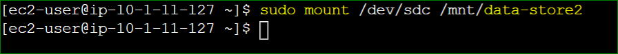
</p>

<p align="center">
  <em>Figure 21: Mount Restored Volume</em>
</p>

---

## Verify Restored File

```text
ls /mnt/data-store2/
```

### Verify Restored File

<p align="center">
  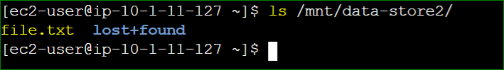
</p>

<p align="center">
  <em>Figure 22: Verify Restored File</em>
</p>

---

# ✅ Conclusion

In this lab, you successfully:

- Created an Amazon EBS volume
- Attached it to an EC2 instance
- Created a filesystem
- Mounted the volume
- Created a snapshot backup
- Restored the snapshot
- Mounted the restored volume
- Verified data recovery

---

